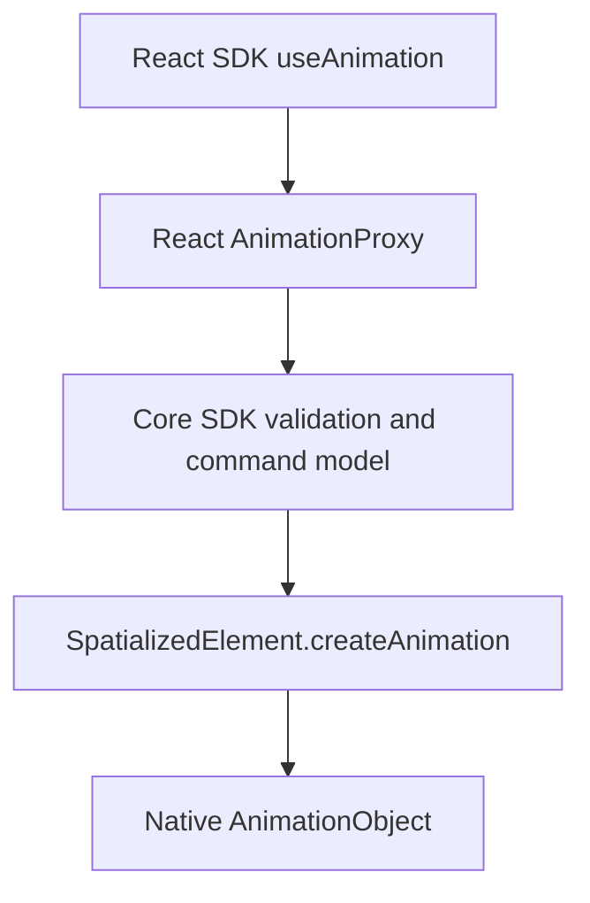
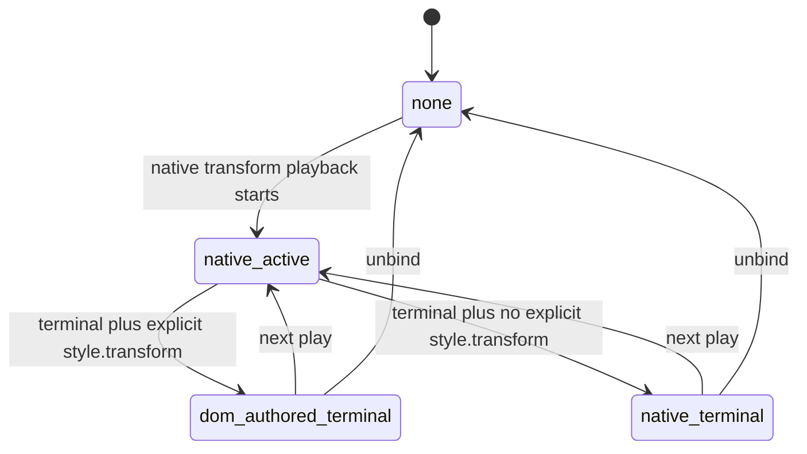
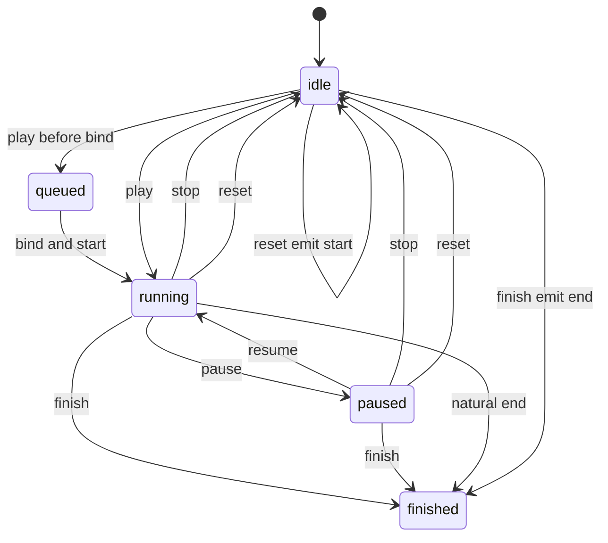

## Context

This change defines declarative motion for three spatialized container kinds:

- `spatialized2d` via `Spatialized2DElement`
- `static3d` via `SpatializedStatic3DElement`
- `dynamic3d` via `SpatializedDynamic3DElement`

All three share the same authoring model and the same canonical `tracks` execution model, but they differ in React integration points and native write paths. Entity animation remains a separate stack and is not part of this target-state design.

## Design Evolution

### Plan A foundations

Plan A established the primitives that remain normative here:

- Session lifecycle and playback state
- Animation-owned field masking during native-controlled playback
- Native per-frame sampling semantics
- Lifecycle callback mutual exclusion
- Single-segment `from` and `to` authoring as a convenience shape

### Plan B generalization

Plan B introduced the general-purpose timeline model:

- Canonical per-property `tracks`
- `style` as the single React merge outlet
- Bind-time target resolution through `xr-animation`

The target state deliberately does not keep the Web RAF backend as a playback path. Pure Web runtimes are capability-negative for `useAnimation` spatialized targets.

### Unified target state

This design merges those ideas into a single three-layer architecture:

- `React SDK` defines authoring, binding, and the React `AnimationProxy`
- `Core SDK` defines config normalization, playback semantics, and object-channel payloads
- `Native Runtime` defines `AnimationObject : SpatialObject`, target-specific playback, and write paths

## Goals

- One authoring API for 2D, Static3D, and Dynamic3D container motion
- One canonical timeline model for all execution paths
- One shared playback API and callback contract across all kinds
- Clear separation between React authoring, Core execution, and Native playback
- Explicit cross-layer contracts so module responsibilities are easy to reason about

## Architecture



## Core SDK

### Modules

| Module | Responsibility |
|--------|----------------|
| `AnimationProxyCore` | Core state holder behind React `AnimationProxy`. Owns queued commands, public playback state projection, terminal command semantics, and the current `AnimationObject` identity. |
| `evaluateMotionTimeline` | Samples canonical `tracks` at timeline time `t`, applies `timingFunction`, and assembles visual values. |
| `validateSpatializedMotionConfig` | Validates authoring config before playback or native send. |
| `motionConfigToAnimationTimeline` | Compiles normalized motion config into the canonical `CreateSpatializedElementAnimation` payload. |
| `animationObjectChannel` | Sends create, control, destroy, and state-listener requests to spatialized native elements. |
| `ELEMENT_ANIMATING_MASK_POLICIES` | Encodes per-kind animation-owned field mask behavior and terminal handoff rules. |

### Interfaces

#### Config and data types

- `SpatializedMotionConfig`
- `SpatializedMotionSegmentConfig`
- `SpatializedMotionTimelineConfig`
- `SpatializedMotionTrack`
- `SpatializedMotionTimeline`
- `SpatializedVisualValues`
- `SpatializedPlaybackError`

#### Playback interface

`SpatializedPlaybackApi` defines:

- `play()`
- `pause()`
- `resume()`
- `stop()`
- `reset()`
- `finish()`
- `isAnimating`
- `isPaused`
- `finished`
- `playState`

### Behavior

#### Config normalization

The Core layer accepts three mutually exclusive authoring shapes:

- Segment config via `from` and `to` as the recommended v1 public path
- Percentage-key `timeline` as the recommended v1 public keyframe path
- Direct `tracks` as the canonical internal model, still accepted by the current implementation and types as a compatibility / advanced escape hatch

All non-track shapes normalize to canonical `tracks` before execution. Native playback for `useAnimation` always uses this canonical tracks model and must not downgrade to a legacy segment payload.

#### Timeline evaluation

`evaluateMotionTimeline` defines the shared interpolation rules:

- Each track is sampled independently
- Before the first keyframe, use the first value
- After the last keyframe, use the last value
- Resolve `timingFunction` in this order:
  1. keyframe
  2. track
  3. config
  4. `linear`
- Compose transforms in fixed order: translate → rotate → scale

#### Playback semantics

`AnimationProxyCore` and the native `AnimationObject` jointly own the normative playback behavior:

- `play()` starts playback or resumes from paused progress
- `play()` while already running is a no-op
- `pause()` pauses the entire controller session; it does not accept keys or partial selectors
- `resume()` resumes the entire controller session; it does not accept keys or partial selectors
- `stop()` terminates only an active session and freezes the sampled current values
- `reset()` always seeks to start values, even when already idle
- `finish()` always seeks to end values, even when already idle
- `finished` becomes `false` after `stop()` and `reset()`
- `finished` becomes `true` after `finish()` and natural completion
- starting a new session from `idle` or `finished` snapshots the latest config
- `play()` while `paused` is still a pure `resume()` and MUST NOT load a new config
- `stop()` / `reset()` / `finish()` operate on the current or most recently stopped/finished session snapshot, not on later `updateConfig(...)` calls
- controller state is whole-session only; no partially-paused aggregate state or pause-reason stacking is modeled
- paused `play()` is semantically equivalent to `resume()`

#### AnimationObject lifecycle

Each resolved binding owns at most one native `AnimationObject` at a time:

- bind creates it through `SpatializedElement.createAnimation(config)`
- create locks the normalized timeline config
- config changes destroy the previous object and create a new object
- unbind destroys the current object
- explicit pre-bind `play()` queues on the proxy and is delivered to the object after bind
- `autoStart: false` only disables implicit play-on-bind; it does not remove queued explicit commands

### Boundaries

The Core layer does not define:

- React component APIs
- JSX binding prop types
- Native manager class internals
- Entity motion behavior

## React SDK

### Modules

| Module | Responsibility |
|--------|----------------|
| `useAnimation` | Public authoring hook. Returns `[animation, api, style]` and remains target-agnostic until bind time. |
| `createAnimationProxy` | Produces the opaque `xr-animation` binding object that carries deferred target state and current `AnimationObject` identity. |
| `createPlaybackApi` | Exposes a stable React-facing playback surface backed by the proxy. |
| `useBindSpatializedAnimation` | Internal binding hook that centralizes attach, unbind, cleanup, and element animating mask synchronization. |
| `Spatialized2DElement binding layer` | Binds 2D `xr-animation` to `Spatialized2DElement` and coordinates the element animating mask with ordinary element sync. |
| `Model` | React integration point that resolves binding target to `static3d`. |
| `Reality` | React integration point that resolves binding target to `dynamic3d`. |

### Interfaces

#### Public hook

`useAnimation(config)` returns:

- `animation`
- `api`
- `style`

The recommended end-user React SDK entry stays `useAnimation`. Legacy controller and backend
classes are not target-state execution primitives and are not presented as public exports from
the React SDK root entry or motion sub-entry.

#### Binding

The React layer defines the `xr-animation` prop as the target binding channel:

- `<div enable-xr xr-animation={animation}>`
- `<Model xr-animation={animation}>`
- `<Reality xr-animation={animation}>`

#### Style outlet

`style` is the only author-facing visual merge outlet:

- For `spatialized2d`, `style` carries terminal and authored visual handoff values; it is not a Web RAF playback backend
- For `static3d` and `dynamic3d`, `style` is always an empty object that is safe to spread; native playback is driven entirely through `xr-animation`

The `style` fallback decision remains a React concern, but it is defined as a
pure mapping from sampled values plus binding state:

- `static3d` and `dynamic3d` always return an empty object
- `spatialized2d` with active native playback masks animation-owned fields such as
  `opacity` and `transform`
- Pure Web runtimes do not run a target-state Web RAF fallback; capability checks return false

For `spatialized2d`, terminal handling of `opacity` adds one more ownership rule:

- Explicit authored opacity means only `style.opacity` provided directly in React props on the bound node
- `className`, external stylesheets, inherited visual dimming, and `getComputedStyle()` results are not treated as explicit authored opacity
- After `stop()`, `reset()`, or `finish()`, explicit authored opacity wins as the visual source of truth for `opacity`
- When no explicit authored opacity exists, the terminal sampled/native opacity remains the visual source of truth
- This rule is limited to visual handoff for `opacity`; terminal callbacks and sampled values still come from Core/native semantics

### Behavior

#### Bind-time target resolution

The React layer resolves the target only when `animation` is bound:

- `enable-xr` node → `spatialized2d`
- `Model` → `static3d`
- `Reality` → `dynamic3d`

If `api.play()` is called before a bind exists, the command queues and begins once the target resolves.
This means the proxy is allowed to be constructed without `kind`, but the binding flow
must resolve and write the target `kind` before `SpatializedElement.createAnimation(config)` executes.

The React hook MUST NOT call `api.play()` from a mount effect just to
implement `autoStart`. `autoStart` is handled only by Core when the target
resolves and `attachElement()` completes. React may still expose pre-bind
`api.play()` queue semantics through the proxy.

#### Single-bind constraint

One binding instance may control only one mounted target at a time. If the same binding is passed to multiple components simultaneously, the first bind wins and later binds warn or fail.

#### Style semantics

For `spatialized2d`:

- During native-controlled playback, `style` remains the React merge outlet, but intermediate native-owned fields are controlled by the element animating mask
- When native spatial animation capability is unavailable, the spatialized target is unsupported instead of falling back to Web RAF

For `static3d` and `dynamic3d`:

- React does not drive root transform playback through `style`
- Native playback is triggered by the bound `xr-animation` handle

#### 2D opacity terminal ownership design

The `spatialized2d` opacity issue is treated as an ownership problem, not an
interpolation problem. `stop()`, `reset()`, and `finish()` keep their existing
terminal sampled-value semantics. The design change applies only to who remains
responsible for visual `opacity` after a terminal transition.

This design follows four implementation principles:

- single-writer principle: visual `opacity` has exactly one effective owner at a time
- explicit state modeling: terminal ownership is represented as a small ownership state machine rather than scattered boolean checks
- strategy-based terminal selection: terminal ownership is selected from explicit React `style.opacity` vs terminal native opacity
- controlled/uncontrolled boundary: explicit React `style.opacity` is treated as authored control; otherwise the runtime terminal value remains authoritative

The ownership state machine is intentionally small:


The practical rule is:

- when explicit React `style.opacity` exists on the bound node, terminal ownership hands back to the DOM side after `stop()`, `reset()`, or `finish()`
- when explicit React `style.opacity` does not exist, terminal ownership stays with the native sampled terminal opacity

Module responsibilities are split deliberately:

- `Spatialized2DElementContainer` captures whether the bound React node explicitly authored `style.opacity`
- `useAnimation` coordinates terminal ownership using sampled values, animating mask state, and authored-opacity metadata
- `resolveMotionStyle` decides whether inner DOM `opacity` is omitted or restored to the explicit authored value
- the element sync layer coordinates ordinary element sync so terminal handoff does not leave both outer native opacity and inner DOM opacity active
- `AnimationObject` continues to provide terminal sampled values and does not infer authored ownership

This keeps terminal callbacks unchanged:

- `onStop(values)` still receives the sampled current values
- `onReset(values)` still receives the start values
- `onComplete(values)` for `finish()` still receives the end values

Only post-terminal visual ownership changes. The design goal is to prevent a
post-terminal state where outer native opacity and inner DOM opacity continue
controlling the same visual result at the same time.

#### Host transform terminal ownership design

Host-transform targets (`spatialized2d` and `dynamic3d`) have the same class of
post-terminal ownership problem as `opacity`: active playback masks animation-owned
outer transform sync correctly, but `stop()`, `reset()`, and `finish()` currently
change the mask without defining who continues to own the visual host
transform. The result is a terminal snap-back where DOM sync
immediately re-applies the static host transform and overwrites the sampled
native terminal pose.

This design reuses the same ownership model as `opacity`, but with
target-specific host-transform sinks:

- single-writer principle: visual host `transform` has exactly one effective owner at a time
- explicit state modeling: animating mask release is a transform ownership decision point, not implicit permission for DOM sync to resume
- strategy-based terminal selection: the terminal owner is chosen from explicit React `style.transform` vs the native sampled terminal host transform
- target-scoped sinks: `spatialized2d` and `dynamic3d` both participate in host-transform ownership, while `static3d` remains out of scope because its motion sink is primarily `modelTransform`

The ownership state machine remains intentionally small:



The practical rule is:

- for host-transform targets, explicit React `style.transform` on the bound node qualifies as the authored DOM-side terminal source after `stop()`, `reset()`, or `finish()`
- values that appear only through `className`, stylesheet rules, inherited layout effects, the `useAnimation()` style outlet, or `getComputedStyle()` do not qualify as authored host-transform ownership
- when explicit React `style.transform` does not exist, terminal ownership stays with the native sampled terminal host transform

Target-specific consequences are deliberate:

- `spatialized2d`: the style outlet remains the active merge outlet, but post-terminal ownership must not silently fall back to the initial DOM transform when no explicit authored `style.transform` exists
- `dynamic3d`: host transform sync must not re-apply the static DOM transform while native terminal transform ownership remains active
- `static3d`: this design does not change `modelTransform` ownership; any future `static3d` host-transform semantics must be specified separately

Module responsibilities are split deliberately:

- the React binding layer captures whether the bound host explicitly authored `style.transform`
- `useAnimation` and binding metadata coordinate post-terminal transform ownership using sampled values, animating mask state, and authored-transform metadata
- target-specific style / sync adapters decide whether DOM-side transform should be omitted or restored after mask ownership changes
- the element sync layer coordinates outer native transform sync so terminal handoff does not leave both native host transform and DOM host transform active at the same time
- `AnimationObject` continues to provide terminal sampled values and does not infer authored transform ownership

This keeps terminal callbacks unchanged:

- `onStop(values)` still receives the sampled current values
- `onReset(values)` still receives the start values
- `onComplete(values)` for `finish()` still receives the end values

Only post-terminal visual ownership changes. The design goal is to prevent a
post-terminal state where native host transform and DOM host transform
continue controlling the same visual result at the same time.

### Boundaries

The React layer does not define:

- Timeline interpolation formulas
- Native sampling algorithms
- Native manager implementation details
- Entity animation stack behavior

## Native Runtime

### Modules

| Module | Responsibility |
|--------|----------------|
| `AnimationObject` | Native `SpatialObject` that owns a locked timeline, playback state, terminal values, and target-specific writes for one spatialized element. |
| `SpatializedElement.createAnimation(config)` | Element method that creates an `AnimationObject` and returns its identity to JS. |
| `SpatializedElementAnimationSampler` | Native sampler for canonical tracks playback. |
| `SpatializedElementAnimationTransformAdapter` | Abstracts target-specific writes for `element.transform` and `modelTransform`. |
| `CreateSpatializedElementAnimation` | JSB/WebMsg entrypoint for creating and locking the native animation object. |
| `ControlSpatializedElementAnimation` | JSB/WebMsg entrypoint for play, pause, resume, stop, reset, finish, and destroy commands. |
| `SpatialAnimationStateChanged` | JSB/WebMsg event for state changes, terminal values, and async errors. |

### Interfaces

#### Command surface

The Native layer accepts the canonical command family:

- `create`
- `play`
- `pause`
- `resume`
- `stop`
- `reset`
- `finish`
- `destroy`

#### Create and control payloads

The create payload carries:

- `animationId`
- `targetKind`
- `elementId`
- `timeline`

`timeline` is the canonical tracks document sent by Core during create. It also carries
`duration`, per-track and per-keyframe `timingFunction`, plus timeline-level
`delay`, `playbackRate`, and `loop`.

The control payload carries:

- `animationId`
- command type

### Behavior

#### Target-specific write paths

Native applies sampled values to different sinks per kind:

- `spatialized2d` → `element.transform` and `opacity`
- `static3d` → `modelTransform`; `opacity` is rejected before create
- `dynamic3d` → `element.transform` and `opacity`

#### Canonical tracks execution

The Native layer must evaluate the locked canonical tracks payload directly. For this API, native playback must not replace tracks execution with a legacy `from` and `to` interpolation path.

#### Terminal command behavior

The Native layer must return values aligned with Core semantics:

- `stop()` returns current sampled values
- `reset()` returns start values
- `finish()` returns end values
- natural completion returns end values

#### Native parity requirement

Native sampling must remain aligned with the Web evaluator for:

- per-track interpolation
- hold behavior
- transform compose order
- terminal sampled values

### Boundaries

The Native layer does not define:

- React hook return shapes
- author-facing config sugar
- entity animation manager behavior
- capability probe API shape

## Cross-layer contracts

### React SDK to Core SDK

The React layer passes authoring config and lifecycle to Core through:

- `useAnimation(config)`
- `createAnimationProxy`
- `createPlaybackApi`

Core remains the owner of normalized config, queued commands, play state projection, and terminal command semantics. Native `AnimationObject` remains the execution owner.

#### Hook tuple contract

```typescript
type UseAnimationResult = readonly [
  animation: SpatializedAnimationProxyInternal,
  api: SpatializedPlaybackApi,
  style: CSSProperties,
]
```

- `animation` is the opaque binding handle passed through `xr-animation`
- `api` is the stable imperative playback surface backed by Core
- `style` is the only author-facing visual outlet

#### Binding contract

```typescript
interface SpatializedAnimationProxyInternal {
  readonly __kind: 'spatializedAnimation'
  readonly __propName: 'xr-animation'
  readonly __animationObjectId: string | null
  get __animating(): boolean
  __getAnimatingMask(): Set<string> | null
  __setElement?: (
    element: HTMLElement | Spatialized2DElement | SpatializedStatic3DElement | SpatializedDynamic3DElement | null,
    targetKind?: SpatializedMotionKind,
  ) => void
  __onUnbind?: () => void
}
```

- React owns creation and mount-time wiring of this object
- Core owns queued command state, playback state projection, and object-channel lifecycle behind it
- Applications treat it as opaque and only pass it through `xr-animation`

### Core SDK to Native Runtime

The Core layer sends canonical animation object commands through JSB/WebMsg:

- `CreateSpatializedElementAnimation`
- `ControlSpatializedElementAnimation`
- listener subscription for `SpatialAnimationStateChanged`
- canonical `timeline` payload
- terminal commands for `stop`, `reset`, and `finish`

#### Command contract

```typescript
interface CreateSpatializedElementAnimationCommand {
  animationId: string
  targetKind: 'spatialized2d' | 'static3d' | 'dynamic3d'
  elementId: string
  timeline: SpatializedMotionTimeline
}

interface ControlSpatializedElementAnimationCommand {
  animationId: string
  type: 'play' | 'pause' | 'resume' | 'stop' | 'reset' | 'finish' | 'destroy'
}
```

- For the target-state `useAnimation` path, `create` uses `timeline` as the canonical execution document
- `play` is a control command against an already-created object and does not carry a new timeline
- `targetKind` is filled in by Core after React bind-time target resolution and before create
- controller-level pause and resume are whole-session operations only; any future local track/action control must be designed as a separate API in a new change

#### Canonical timeline payload

```typescript
interface SpatializedMotionTimeline {
  duration: number
  delay?: number
  playbackRate?: number
  loop?: boolean | { reverse?: boolean }
  tracks: Array<{
    property: SpatializedMotionProperty
    keyframes: Array<{
      at: number
      value: number
      timingFunction?: TimingFunction
    }>
    timingFunction: TimingFunction
  }>
}
```

- This is the only stable cross-layer create document for target-state container motion
- Segment-style `from` and `to` authoring must be compiled to this shape before object creation
- Timeline-level `delay`, `playbackRate`, and `loop` live inside this payload rather than on the outer command
- Public docs should continue to present `timeline` as a single CSS `@keyframes`-style object, not as a sequential choreography array or multi-action primitive

### Native Runtime to Core SDK

The Native layer returns:

- completion values
- stop values
- reset values
- finish values
- async playback errors

Core forwards those values to React-facing callbacks and style updates.

#### Play handle contract

```typescript
interface SpatialAnimationStateChanged {
  animationId: string
  state: 'idle' | 'queued' | 'running' | 'paused' | 'finished' | 'destroyed' | 'error'
  terminalReason?: 'complete' | 'stop' | 'reset' | 'finish'
  values?: SpatializedVisualValues
  error?: SpatializedPlaybackError
}
```

- natural completion reports `terminalReason: 'complete'` with end values
- `stop`, `reset`, and `finish` report their own terminal reason and values
- async failures report `state: 'error'` with the error payload

#### Terminal value contract

For terminal commands issued after playback has started:

- `stop()` returns sampled current values
- `reset()` returns start values
- `finish()` returns end values

Those values are consumed by Core as the source of:

- `onStop(values)`
- `onReset(values)`
- `onComplete(values)` for `finish()`
- style synchronization after terminal state transitions

For `spatialized2d`, style synchronization after terminal transitions is split
into two concerns:

- terminal sampled/native values remain the source for callbacks and terminal session semantics
- `opacity` visual ownership may hand off to explicit authored `style.opacity` when one exists on the bound React node
- the handoff MUST avoid leaving native outer opacity and inner DOM opacity active at the same time after the animating mask changes

#### Error contract

```typescript
interface SpatializedPlaybackError {
  animationId: string
  command: 'play' | 'pause' | 'resume' | 'stop' | 'reset' | 'finish'
  code?: string
  reason: string
}
```

- Native owns the async failure source
- Core owns error fan-out to callbacks or logging

## Shared semantics

### Playback state



### Lifecycle callbacks

The callback contract is shared across all kinds:

| Callback | Trigger | Value |
|----------|---------|-------|
| `onStart` | First frame after playback begins | none |
| `onComplete` | Natural completion or `finish()` | end values |
| `onStop` | `stop()` | sampled current values |
| `onReset` | `reset()` | start values |
| `onError` | Async native failure | `SpatializedPlaybackError` |

Exactly one of `onComplete`, `onStop`, or `onReset` fires per termination path.

### Element animating mask

The element animating mask is the shared cross-layer rule:

- `opacity` tracks mask only `opacity` sync
- any `transform.*` track masks transform sync as a whole
- the mask updates on active playback, terminal state, recreate, destroy, and unbind

For `spatialized2d` opacity, mask release or update is therefore paired with the
terminal ownership decision above. Releasing the mask is not permission for
dual ownership; it is the point where the system reassigns the single visual
owner of `opacity`.

For `spatialized2d` terminal `opacity` handoff, clearing the mask is a
release of DOM sync authority, not permission for simultaneous ownership:

- if explicit authored `style.opacity` exists, mask release restores that authored opacity as the only post-terminal visual owner
- if explicit authored `style.opacity` does not exist, mask release preserves terminal native opacity ownership for the post-terminal visual result

## Non-goals

This design does not cover:

- Entity animation convergence
- Material or variant animation
- Layout field animation
- Physics or spring simulation
- Arbitrary transform string interpolation

## Delivery note

This document describes the target-state design and module boundaries. Delivery history, phase ordering, and migration progress remain tracked in [tasks.md](./tasks.md).
