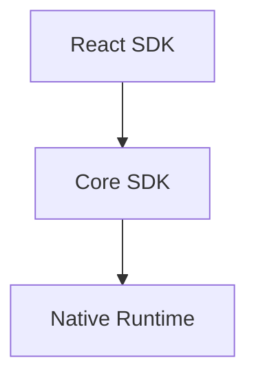
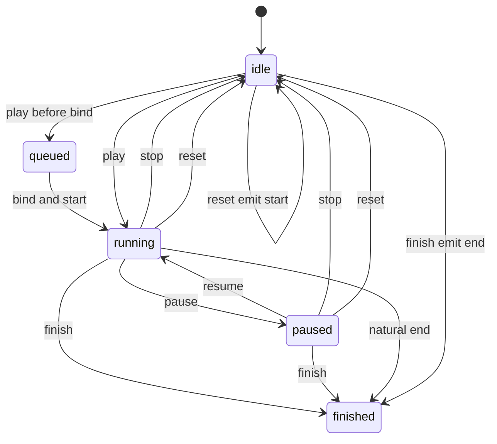

## Context

This change defines declarative motion for three spatialized container kinds:

- `spatialized2d` via `Spatialized2DElement`
- `static3d` via `SpatializedStatic3DElement`
- `dynamic3d` via `SpatializedDynamic3DElement`

All three share the same authoring model and the same canonical `tracks` execution model, but they differ in React integration points and native write paths. Entity animation remains a separate stack and is not part of this target-state design.

## Design Evolution

### Plan A foundations

Plan A established the primitives that remain normative here:

- Session lifecycle and playback state
- Portal suppression during native-controlled playback
- Native per-frame sampling semantics
- Lifecycle callback mutual exclusion
- Single-segment `from` and `to` authoring as a convenience shape

### Plan B generalization

Plan B introduced the general-purpose timeline model:

- Canonical per-property `tracks`
- Web RAF for 2D when native motion is unavailable
- `style` as the single React merge outlet
- Bind-time target resolution through `xr-animation`

### Unified target state

This design merges those ideas into a single three-layer architecture:

- `React SDK` defines authoring and binding
- `Core SDK` defines config normalization, playback semantics, and bridge payloads
- `Native Runtime` defines target-specific playback and write paths

## Goals

- One authoring API for 2D, Static3D, and Dynamic3D container motion
- One canonical timeline model for all execution paths
- One shared playback API and callback contract across all kinds
- Clear separation between React authoring, Core execution, and Native playback
- Explicit cross-layer contracts so module responsibilities are easy to reason about

## Architecture



## Core SDK

### Modules

| Module | Responsibility |
|--------|----------------|
| `SpatializedMotionController` | Canonical playback controller for container motion. Owns play state, backend selection, terminal command semantics, and suppression state. |
| `evaluateMotionTimeline` | Samples canonical `tracks` at timeline time `t`, applies `timingFunction`, and assembles visual values. |
| `validateSpatializedMotionConfig` | Validates authoring config before playback or native send. |
| `motionConfigToNativeTimeline` | Compiles normalized motion config into the canonical native wire payload. |
| `motionElementBridge` | Sends `play`, `pause`, `resume`, `stop`, `reset`, and `finish` commands from Core to spatialized native elements and cleans up listeners. |
| `MOTION_KIND_POLICIES` | Encodes per-kind policy for Web RAF availability and suppression rules. |

### Interfaces

#### Config and data types

- `SpatializedMotionConfig`
- `SpatializedMotionSegmentConfig`
- `SpatializedMotionTimelineConfig`
- `SpatializedMotionTrack`
- `SpatializedMotionTimeline`
- `SpatializedVisualValues`
- `SpatializedPlaybackError`

#### Playback interface

`SpatializedPlaybackApi` defines:

- `play()`
- `pause()`
- `resume()`
- `stop()`
- `reset()`
- `finish()`
- `isAnimating`
- `isPaused`
- `finished`
- `playState`

### Behavior

#### Config normalization

The Core layer accepts three mutually exclusive authoring shapes:

- Segment config via `from` and `to` as the recommended v1 public path
- Percentage-key `timeline` as the recommended v1 public keyframe path
- Direct `tracks` as the canonical internal model, still accepted by the current implementation and types as a compatibility / advanced escape hatch

All non-track shapes normalize to canonical `tracks` before execution. Native playback for `useAnimation` always uses this canonical tracks model and must not downgrade to a legacy segment payload.

#### Timeline evaluation

`evaluateMotionTimeline` defines the shared interpolation rules:

- Each track is sampled independently
- Before the first keyframe, use the first value
- After the last keyframe, use the last value
- Resolve `timingFunction` in this order:
  1. keyframe
  2. track
  3. config
  4. `linear`
- Compose transforms in fixed order: translate → rotate → scale

#### Playback semantics

`SpatializedMotionController` owns the normative playback behavior:

- `play()` starts playback or resumes from paused progress
- `play()` while already running is a no-op
- `pause()` pauses the entire controller session; it does not accept keys or partial selectors
- `resume()` resumes the entire controller session; it does not accept keys or partial selectors
- `stop()` terminates only an active session and freezes the sampled current values
- `reset()` always seeks to start values, even when already idle
- `finish()` always seeks to end values, even when already idle
- `finished` becomes `false` after `stop()` and `reset()`
- `finished` becomes `true` after `finish()` and natural completion
- starting a new session from `idle` or `finished` snapshots the latest config
- `play()` while `paused` is still a pure `resume()` and MUST NOT load a new config
- `stop()` / `reset()` / `finish()` operate on the current or most recently stopped/finished session snapshot, not on later `updateConfig(...)` calls
- controller state is whole-session only; no partially-paused aggregate state or pause-reason stacking is modeled
- paused `play()` is semantically equivalent to `resume()`

#### Backend policy

Per-kind backend policy is chosen by `MOTION_KIND_POLICIES`:

- `spatialized2d`
  - Web RAF allowed
  - Native allowed when capability is available
- `static3d`
  - Native only
- `dynamic3d`
  - Native only

### Boundaries

The Core layer does not define:

- React component APIs
- JSX binding prop types
- Native manager class internals
- Entity motion behavior

## React SDK

### Modules

| Module | Responsibility |
|--------|----------------|
| `useAnimation` | Public authoring hook. Returns `[animation, api, style]` and remains target-agnostic until bind time. |
| `useMotionController` | Connects React lifecycle to the Core controller. |
| `createMotionBinding` | Produces the opaque `xr-animation` binding object that carries deferred target state. |
| `createPlaybackApi` | Exposes a stable React-facing playback surface backed by the controller. |
| `useBindSpatializedMotion` | Internal binding hook that centralizes attach, unbind, cleanup, and optional 2D suppression synchronization. |
| `PortalSpatializedContainer` | Binds 2D `xr-animation` to `Spatialized2DElement` and coordinates suppression with Portal sync. |
| `Model` | React integration point that resolves binding target to `static3d`. |
| `Reality` | React integration point that resolves binding target to `dynamic3d`. |

### Interfaces

#### Public hook

`useAnimation(config)` returns:

- `animation`
- `api`
- `style`

The recommended end-user React SDK entry stays `useAnimation`. `SpatializedMotionController`
and `SpatializedMotionHandle` remain Core-level imperative utility / internal seam types and
are no longer presented as public exports from the React SDK root entry or motion sub-entry.

#### Binding

The React layer defines the `xr-animation` prop as the target binding channel:

- `<div enable-xr xr-animation={animation}>`
- `<Model xr-animation={animation}>`
- `<Reality xr-animation={animation}>`

#### Style outlet

`style` is the only author-facing visual merge outlet:

- For `spatialized2d`, `style` carries active animated values and serves as the Web fallback / non-native visual outlet
- For `static3d` and `dynamic3d`, `style` is always an empty object that is safe to spread; native playback is driven entirely through `xr-animation`

The `style` fallback decision remains a React concern, but it is defined as a
pure mapping from sampled values plus binding state:

- `static3d` and `dynamic3d` always return an empty object
- `spatialized2d` with active native playback masks suppressed fields such as
  `opacity` and `transform`
- Web fallback returns `valuesToMotionStyle(values)` without React re-implementing
  timeline evaluation rules

### Behavior

#### Bind-time target resolution

The React layer resolves the controller target only when `animation` is bound:

- `enable-xr` node → `spatialized2d`
- `Model` → `static3d`
- `Reality` → `dynamic3d`

If `api.play()` is called before a bind exists, the command queues and begins once the target resolves.
This means the controller is allowed to be constructed without `kind`, but the binding flow
must resolve and write the target `kind` before the backend actually executes playback.

The React hook MUST NOT call `controller.play()` from a mount effect just to
implement `autoStart`. `autoStart` is handled only by Core when the target
resolves and `attachElement()` completes. React may still expose pre-bind
`api.play()` queue semantics through the controller.

#### Single-bind constraint

One binding instance may control only one mounted target at a time. If the same binding is passed to multiple components simultaneously, the first bind wins and later binds warn or fail.

#### Style semantics

For `spatialized2d`:

- Web RAF directly drives the `style` outlet when native motion is unavailable
- During native-controlled playback, `style` remains the React merge outlet, but intermediate native-owned fields are suppression-controlled

For `static3d` and `dynamic3d`:

- React does not drive root transform playback through `style`
- Native playback is triggered by the bound `xr-animation` handle

### Boundaries

The React layer does not define:

- Timeline interpolation formulas
- Native sampling algorithms
- Native manager implementation details
- Entity animation stack behavior

## Native Runtime

### Modules

| Module | Responsibility |
|--------|----------------|
| `SpatializedElementMotionManager` | Unified native manager for spatialized element motion across 2D, Static3D, and Dynamic3D. |
| `SpatializedElementMotionTimelineSampler` | Native sampler for canonical tracks playback. |
| `SpatializedElementMotionTransformAdapter` | Abstracts target-specific writes for `element.transform` and `modelTransform`. |
| `AnimateSpatializedElementMotion` listener | Native JSB entrypoint for motion commands and timeline payloads. |

### Interfaces

#### Command surface

The Native layer accepts the canonical command family:

- `play`
- `pause`
- `resume`
- `stop`
- `reset`
- `finish`

#### Play payload

The `play` payload carries:

- `animationId`
- `targetKind`
- `elementId`
- `timeline`

`timeline` is the canonical tracks document sent by Core. It also carries
`duration`, per-track and per-keyframe `timingFunction`, plus timeline-level
`delay`, `playbackRate`, and `loop`.

### Behavior

#### Target-specific write paths

Native applies sampled values to different sinks per kind:

- `spatialized2d` → `element.transform` and `opacity`
- `static3d` → `modelTransform` and `opacity`
- `dynamic3d` → `element.transform` and `opacity`

#### Canonical tracks execution

The Native layer must evaluate the canonical tracks payload directly. For this API, native playback must not replace tracks execution with a legacy `from` and `to` interpolation path.

#### Terminal command behavior

The Native layer must return values aligned with Core semantics:

- `stop()` returns current sampled values
- `reset()` returns start values
- `finish()` returns end values
- natural completion returns end values

#### Native parity requirement

Native sampling must remain aligned with the Web evaluator for:

- per-track interpolation
- hold behavior
- transform compose order
- terminal sampled values

### Boundaries

The Native layer does not define:

- React hook return shapes
- author-facing config sugar
- entity animation manager behavior
- capability probe API shape

## Cross-layer contracts

### React SDK to Core SDK

The React layer passes authoring config and lifecycle to Core through:

- `useAnimation(config)`
- `createMotionBinding`
- `createPlaybackApi`

Core remains the owner of normalized config, play state, and terminal command semantics.

#### Hook tuple contract

```typescript
type UseAnimationResult = readonly [
  animation: SpatializedMotionBindingInternal,
  api: SpatializedPlaybackApi,
  style: CSSProperties,
]
```

- `animation` is the opaque binding handle passed through `xr-animation`
- `api` is the stable imperative playback surface backed by Core
- `style` is the only author-facing visual outlet

#### Binding contract

```typescript
interface SpatializedMotionBindingInternal {
  readonly __kind: 'spatializedMotion'
  readonly __propName: 'xr-animation'
  readonly __motionObjectId: string
  get __animating(): boolean
  __getSuppressedFields(): Set<string> | null
  __setElement?: (
    element: HTMLElement | Spatialized2DElement | SpatializedStatic3DElement | SpatializedDynamic3DElement | null,
    targetKind?: SpatializedMotionKind,
  ) => void
  __onUnbind?: () => void
}
```

- React owns creation and mount-time wiring of this object
- Core owns the motion object identity, animating state, and suppression state behind it
- Applications treat it as opaque and only pass it through `xr-animation`

### Core SDK to Native Runtime

The Core layer sends canonical motion commands through the bridge:

- `AnimateSpatializedElementMotion`
- canonical `timeline` payload
- terminal commands for `stop`, `reset`, and `finish`

#### Command contract

```typescript
interface AnimateSpatializedElementMotionCommand {
  animationId: string
  type: 'play' | 'pause' | 'resume' | 'stop' | 'reset' | 'finish'
  targetKind: 'spatialized2d' | 'static3d' | 'dynamic3d'
  elementId?: string
  timeline?: SpatializedMotionTimeline
}
```

- For the target-state `useAnimation` path, `play` uses `timeline` as the canonical execution document
- `play` is timeline-only across JSB; top-level timing control fields are not part of the stable wire contract
- `targetKind` is filled in by Core after React bind-time target resolution
- controller-level pause and resume are whole-session operations only; any future local track/action control must be designed as a separate API in a new change

#### Canonical timeline payload

```typescript
interface SpatializedMotionTimeline {
  duration: number
  delay?: number
  playbackRate?: number
  loop?: boolean | { reverse?: boolean }
  tracks: Array<{
    property: SpatializedMotionProperty
    keyframes: Array<{
      at: number
      value: number
      timingFunction?: TimingFunction
    }>
    timingFunction: TimingFunction
  }>
}
```

- This is the only stable cross-layer play document for target-state container motion
- Segment-style `from` and `to` authoring must be compiled to this shape before native send
- Timeline-level `delay`, `playbackRate`, and `loop` live inside this payload rather than on the outer command
- Public docs should continue to present `timeline` as a single CSS `@keyframes`-style object, not as a sequential choreography array or multi-action primitive

### Native Runtime to Core SDK

The Native layer returns:

- completion values
- stop values
- reset values
- finish values
- async playback errors

Core forwards those values to React-facing callbacks and style updates.

#### Play handle contract

```typescript
interface AnimateSpatializedElementMotionResult {
  animationId: string
  finished: Promise<SpatializedVisualValues>
  canceled: Promise<SpatializedVisualValues>
  failed: Promise<SpatializedPlaybackError>
}
```

- `finished` resolves with end values on natural completion
- `canceled` resolves with sampled values for terminal interruption paths surfaced through the unified manager
- `failed` resolves with the async playback error payload

#### Terminal value contract

For terminal commands issued after playback has started:

- `stop()` returns sampled current values
- `reset()` returns start values
- `finish()` returns end values

Those values are consumed by Core as the source of:

- `onStop(values)`
- `onReset(values)`
- `onComplete(values)` for `finish()`
- style synchronization after terminal state transitions

#### Error contract

```typescript
interface SpatializedPlaybackError {
  animationId: string
  command: 'play' | 'pause' | 'resume' | 'stop' | 'reset' | 'finish'
  code?: string
  reason: string
}
```

- Native owns the async failure source
- Core owns error fan-out to callbacks or logging

## Shared semantics

### Playback state



### Lifecycle callbacks

The callback contract is shared across all kinds:

| Callback | Trigger | Value |
|----------|---------|-------|
| `onStart` | First frame after playback begins | none |
| `onComplete` | Natural completion or `finish()` | end values |
| `onStop` | `stop()` | sampled current values |
| `onReset` | `reset()` | start values |
| `onError` | Async native failure | `SpatializedPlaybackError` |

Exactly one of `onComplete`, `onStop`, or `onReset` fires per termination path.

### Suppression

Portal suppression remains a shared cross-layer rule:

- `opacity` tracks suppress only `opacity` sync
- any `transform.*` track suppresses transform sync as a whole
- suppression clears on terminal state or unbind

## Non-goals

This design does not cover:

- Entity animation convergence
- Material or variant animation
- Layout field animation
- Physics or spring simulation
- Arbitrary transform string interpolation

## Delivery note

This document describes the target-state design and module boundaries. Delivery history, phase ordering, and migration progress remain tracked in [tasks.md](./tasks.md).