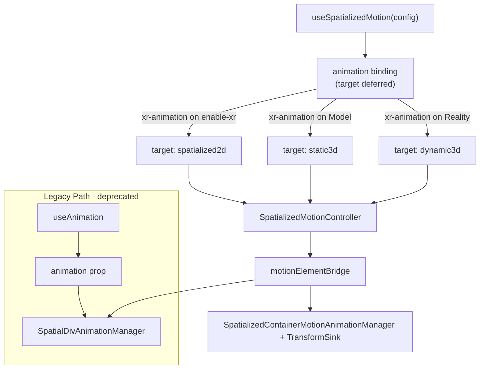
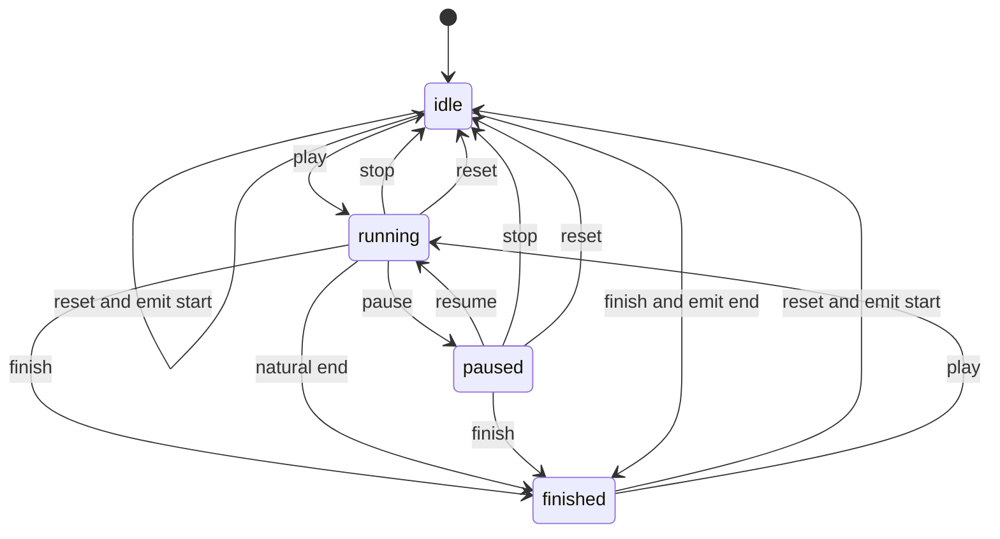

## Context

Three `SpatializedElement` subclasses share scene placement but use **different native write paths**. The timeline evaluator, session state machine, and Portal suppression logic are shared in TypeScript; native applies samples to `element.transform` (2D / Dynamic3D) or `modelTransform` (Static3D). Entity animation remains a **separate** stack (`useAnimation` + `EntityAnimationManager`).

This design unifies **author-facing** config (`SpatializedMotionConfig`, `SpatializedSegmentConfig`, `SpatializedPlaybackApi`) and routes by the **binding target** (resolved when `animation` is passed as `xr-animation` prop to a component) to one Core controller and one React hook. All `useSpatializedMotion` authoring shapes (`from`/`to`, `timeline`, `tracks`) normalize to the same canonical `tracks` model before execution.

## Design Evolution

### Plan A (Session Animation) — Foundations

Plan A established the architectural primitives:
- **Session state machine**: idle → queued → delaying → running → paused → finished
- **Portal suppression**: property-level for opacity, transform-wide for transform fields
- **Native playback model**: CADisplayLink-driven per-frame sampling on visionOS
- **Lifecycle contracts**: onStart/onComplete/onStop/onReset/onError mutual exclusion
- **Authoring convenience**: single `from`/`to` with timing function as a sugar shape that compiles to tracks

These remain normative in the unified system.

### Plan B (Motion Timeline) — Generalization

Plan B extended the architecture:
- **Timeline data model**: per-property tracks with absolute-time keyframes (inspired by Three.js AnimationClip)
- **Dual backend**: Web RAF when native unavailable, native timeline when in WebSpatial runtime
- **Style outlet**: `style` object returned to app code for React state-driven rendering; Plan B also renamed the binding from `animation` to `xr-animation`
- **Multi-kind support**: policy-based routing for spatialized2d / static3d / dynamic3d

### Unified Architecture (this design)

The merge combines both into a single normative system with backward compatibility.

## Goals

- One timeline config shape across 2D / Static3D / Dynamic3D container kinds.
- **One** Core implementation: `SpatializedMotionController` (policy per `kind`) + `element.motion(config)` on each element class.
- **One** React entry: `useSpatializedMotion(config)` accepting `from/to`, `tracks`, or `timeline` (three mutually exclusive shapes). Target resolved at bind time (no `kind` in config). Internally, `from/to` and `timeline` compile to `tracks`.
- Legacy `useAnimation` + `animation` prop retained as deprecated path for 2D.
- Umbrella spec with per-kind sub-specs; 2D remains the reference for Web RAF + suppression behavior.

## Architecture

## Core Modules

| Module | Role |
|--------|------|
| `SpatializedMotionController` | Single TS controller; binding target selects capability token, Web RAF vs native-only, suppressed fields |
| `motionElementBridge` | Dispatches `animateSpatialDiv` vs `animateMotion` + listener cleanup |
| `element.motion(config)` | Factory on each `Spatialized*Element`; returns `SpatializedMotionController` with matching target kind |
| `evaluateMotionTimeline` | Shared Web evaluator: per-track sampling, timingFunction, lerp |
| `SpatialDivTimelineEvaluator` (Swift) | Native parity evaluator: per-track 90Hz sampling via CADisplayLink for the canonical tracks path |
| `SpatializedMotionTransformSink` | Abstracts write path (elementTransform vs modelTransform) for Static3D/Dynamic3D |

## React Modules

| Module | Role |
|--------|------|
| `useSpatializedMotion` | Public hook (tuple return `[animation, api, style]`); accepts `from/to` or `tracks` config; target-agnostic until bind |
| `useMotionController` + `createMotionBinding` + `createPlaybackApi` | Shared wiring |

## Shared Types (Core)

- `spatializedVisual.ts` — values + transform components
- `spatializedMotion.ts` — timeline, segment, playback API, play state, `SpatializedMotionKind`
- `spatializedPlayback.ts` — errors

## Integration Matrix

| Kind | React outlet | Binding prop | Native write path | Web RAF |
|------|--------------|--------------|-------------------|---------|
| 2D | `style` | `xr-animation` on `enable-xr` node | `element.transform` + opacity + DOM | Yes |
| Static3D | `style` unused | `xr-animation` on `<Model>` | `modelTransform` + opacity | No |
| Dynamic3D | `style` unused | `xr-animation` on `<Reality>` | `element.transform` + opacity | No |

## Target Resolution

The `animation` binding returned by `useSpatializedMotion` is **target-agnostic**. Target is resolved at bind time:

1. React component receives `xr-animation={animation}` prop.
2. Component type determines target: `enable-xr` → `spatialized2d`, `<Model>` → `static3d`, `<Reality>` → `dynamic3d`.
3. Controller activates the matching `MOTION_KIND_POLICIES` entry.
4. For 2D: `style` outlet is actively driven by Web RAF or native samples. For 3D: `style` remains `{}`.

**Pre-bind playback:** If `api.play()` is called before the binding is mounted, the command is queued. Playback begins once the target is resolved.

**Single-bind constraint:** A binding instance MUST NOT be passed to multiple components simultaneously. The first bind wins; subsequent binds MUST warn/throw.

## Termination Methods and Style Delivery

The three terminal commands are independent. `stop()` only terminates an active session, while `reset()` and `finish()` always seek to a deterministic endpoint even if the motion is already `idle`. Each command determines a distinct final style value, `playState`, `finished` flag, and lifecycle callback:

| Method | Invocation scope | Style value | playState | finished | Callback | Suppression |
|--------|------------------|-------------|-----------|----------|----------|-------------|
| `stop()` | Active session only | Current frame (frozen at invocation time) | `idle` | `false` | `onStop(values)` | Released |
| `reset()` | Unconditional | From values (initial state) | `idle` | `false` | `onReset(values)` | Released |
| `finish()` | Unconditional | To values (final state) | `finished` | `true` | `onComplete(values)` | Released |
| Natural end | End of active playback | To values (last frame reached) | `finished` | `true` | `onComplete(values)` | Released |

### Backend-symmetric style delivery

Style values for termination methods follow the same dual-backend pattern as regular playback:

| Backend | Value source | Mechanism |
|---------|-------------|-----------|
| **Web** (RAF) | JS `evaluateMotionTimeline(config, t)` computes the target values | `emitValues()` → `onValuesChange` → React state update |
| **Native** | Native runtime provides sampled values via promise resolution | `emitValues()` → `onValuesChange` → React state update |
| **Native (fallback)** | If native does not return values, JS evaluator estimates | Same as Web path |

For `stop()`: `t` = elapsed time at invocation. For `reset()`: `t` = 0. For `finish()`: `t` = duration.

`idle.reset()` MUST still emit the `from` values. `idle.finish()` MUST still emit the `to` values and move `playState` to `finished`. These commands are not aliases for each other and MUST NOT absorb each other's semantics.

### State machine transitions

## Lifecycle Callbacks

| Callback | Trigger | Values passed |
|----------|---------|---------------|
| `onStart` | First frame after `play()` | none |
| `onComplete` | Natural end **or** `finish()` | `SpatializedVisualValues` (to values) |
| `onStop` | `stop()` | `SpatializedVisualValues` (current values) |
| `onReset` | `reset()` | `SpatializedVisualValues` (from values) |
| `onError` | Native bridge failure | `SpatializedPlaybackError` |

**Mutual exclusion:** Per session termination, exactly one of `onComplete` / `onStop` / `onReset` fires. `onError` may fire independently on native failure.

`stop()` and `reset()` MUST always leave `finished === false`. `finish()` and natural completion MUST always leave `finished === true`.

**Alignment with industry standards:**
- `stop()` aligns with React Spring `api.stop()` and Framer Motion `controls.stop()`
- `finish()` aligns with WAAPI `animation.finish()` (fires `onfinish`, same as natural end)
- `reset()` aligns with WAAPI `animation.cancel()` (reverts to pre-animation state)

## Legacy Compatibility

The Plan A path (`useAnimation` + `animation` prop) is retained as a thin compatibility layer:

1. `useAnimation(config)` for SpatialDiv continues to work unchanged.
2. Internally, the legacy path keeps its own segment-native behavior; `useSpatializedMotion` does not downgrade into that command path.
3. The `animation` prop path does NOT use `SpatializedMotionController`; it retains its own session management.
4. New code SHOULD use `useSpatializedMotion({ from, to, duration })` which provides the same single-segment experience.

## Portal Suppression (unified rules)

| Animated field | Suppression scope | Release trigger |
|----------------|-------------------|-----------------|
| `opacity` | Property-level: only `opacity` sync suppressed | Session terminal (finished / stop / reset) |
| Any `transform.*` | Transform-wide: entire `updateTransform(matrix)` suppressed | Session terminal |

Suppression applies to both legacy `animation` prop sessions and `xr-animation` binding sessions. All three termination methods (`stop`, `reset`, `finish`) release suppression.

## Native Timeline Evaluation

Native MUST sample each track independently at timeline time `t` (seconds, after `delay` and `playbackRate`), compose transform in fixed order (translate → rotate → scale), and produce results matching the Web evaluator within tolerance (±0.5 for translate px, ±0.01 for opacity/scale).

## Phased Delivery

See [tasks.md](./tasks.md). Summary:
- Phase 0–1: Umbrella spec + unified naming (completed)
- Phase 2: Static3D + Dynamic3D native timelines (completed)
- Phase 3: Core + React consolidation (completed)
- Phase 4: Entity timeline (deferred)
- Phase 5: Native consolidation (completed)
- Phase 6: Unified JSB + type rename (completed)
- Phase 7: Spec merge (completed)
- Phase 8: Bind-time target resolution (completed)
- Phase 9: Playback API expansion — stop / reset / finish (proposed)
- Phase 10: Timeline percentage keyframe support — `timeline` config shape, `SpatializedMotionKeyframeValues`, three-level `timingFunction` cascade, `easing` → `timingFunction` rename (proposed)