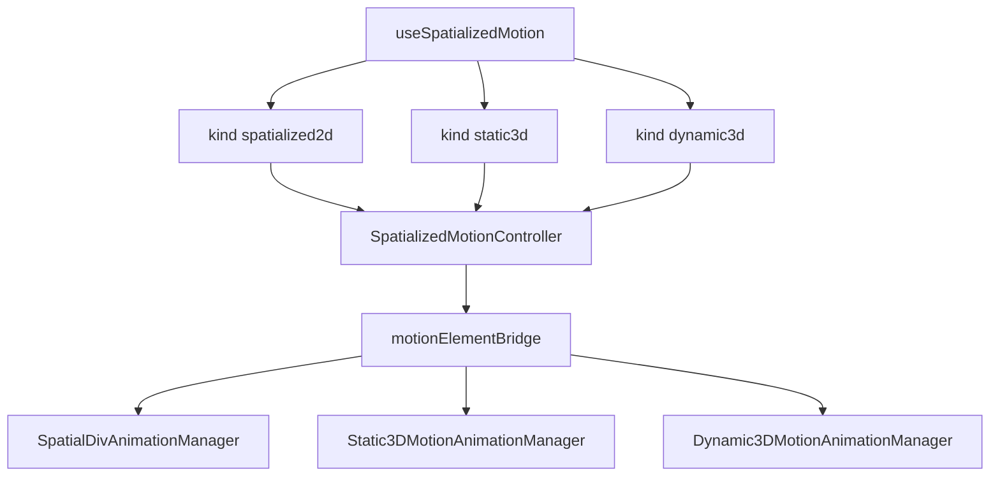

## Context

Three `SpatializedElement` subclasses share scene placement but use **different native write paths**. The timeline evaluator, session state machine, and Portal suppression logic are shared in TypeScript; native applies samples to `element.transform` (2D / Dynamic3D) or `modelTransform` (Static3D). Entity animation remains a **separate** stack (`useAnimation` + `EntityAnimationManager`).

This design unifies **author-facing** config (`SpatializedMotionConfig`, `SpatializedSegmentConfig`, `SpatializedPlaybackApi`) and routes by **`kind`** to one Core controller and one React hook.

## Goals

- One timeline config shape across 2D / Static3D / Dynamic3D container kinds.
- **One** Core implementation: `SpatializedMotionController` (policy per `kind`) + `element.motion(config)` on each element class.
- **One** React entry: `useSpatializedMotion({ kind, … })` and `useSpatializedMotion.simple({ kind, … })`.
- Umbrella spec with per-kind sub-specs; 2D remains the reference for Web RAF + suppression behavior.

## Architecture

**Core modules (shipped):**

| Module | Role |
|--------|------|
| `SpatializedMotionController` | Single TS controller; `MOTION_KIND_POLICIES` selects capability token, Web RAF vs native-only, suppressed fields |
| `motionElementBridge` | Dispatches `animateSpatialDiv` vs `animateMotion` + listener cleanup |
| `SpatialDivMotionController` / `Static3DMotionController` / `Dynamic3DMotionController` | Thin subclasses (`@deprecated` aliases) for typed `attachElement` |

**React modules (shipped):**

| Module | Role |
|--------|------|
| `useSpatializedMotion` | Public hook (`kind` discriminant + `.simple`) |
| `useMotionController` + `createMotionBinding` + `createPlaybackApi` | Shared wiring |

## Shared types (Core)

- [`spatializedVisual.ts`](../../packages/core/src/types/spatializedVisual.ts) — values + transform components (aliases from `spatialDivVisual`).
- [`spatializedMotion.ts`](../../packages/core/src/types/spatializedMotion.ts) — timeline, segment, playback API, play state, `SpatializedMotionKind`.
- [`spatializedPlayback.ts`](../../packages/core/src/types/spatializedPlayback.ts) — errors.

**Out of scope:** Entity kind (`position.*` tracks) — keep `useAnimation` / `AnimateTransform`; do not route through `SpatializedMotionController`.

## Integration

| Kind | React outlet | Binding prop | Native write path | Web RAF |
|------|--------------|--------------|-------------------|---------|
| 2D | `style` | `motion` on `enable-xr` node | `element.transform` + opacity + DOM | Yes |
| Static3D | _(none — native drives view)_ | `motion` on `<Model>` | `modelTransform` + opacity | No |
| Dynamic3D | _(none)_ | `motion` on `<Reality>` | `element.transform` + opacity | No |

## Phased delivery

See [tasks.md](./tasks.md). Native Swift managers remain **three files** (shared session/timeline code); unifying native is Phase 5 (optional).
