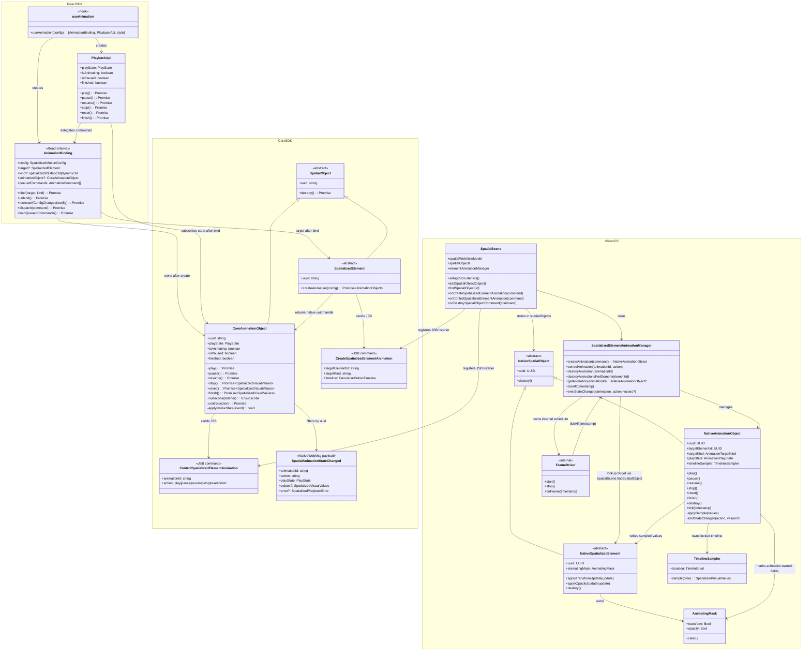
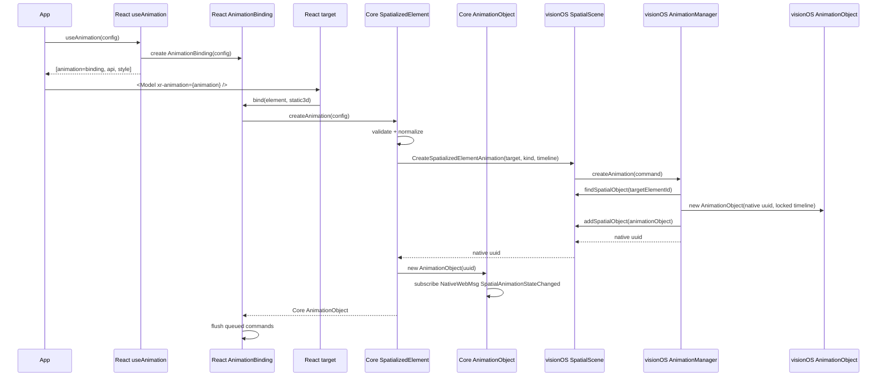
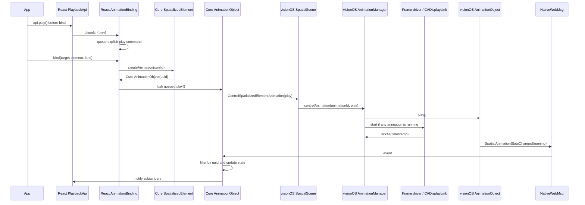
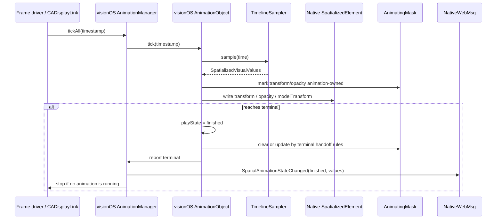
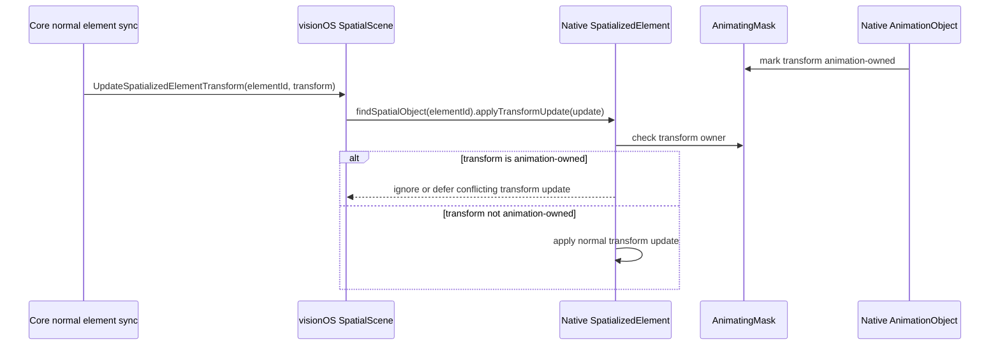
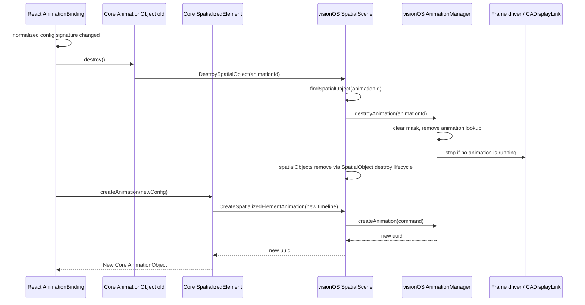

## Context and goals

This change defines declarative motion for three spatialized container kinds:

- `spatialized2d` via `Spatialized2DElement`
- `static3d` via `SpatializedStatic3DElement`
- `dynamic3d` via `SpatializedDynamic3DElement`

All three share the same authoring model and canonical `tracks` execution model, but they differ in React binding entry points and native write paths. Entity animation remains a separate stack and is out of scope for this design.

The target state preserves playback lifecycle, native frame sampling, animation-owned masks, terminal callback semantics, and `from` / `to` authoring from earlier motion designs. It also adopts canonical `tracks` timeline, `xr-animation` bind-time target resolution, and the React `style` outlet.

The target state does not keep the Web RAF backend. Pure Web runtimes are capability-negative for `useAnimation` spatialized targets.

## Target-state architecture

The target implementation is split across React SDK, Core SDK, and native runtime:

- React SDK owns `AnimationBinding`, created by `useAnimation(config)`. It stores config, queues pre-bind commands, and creates the Core `AnimationObject` only after `xr-animation` resolves a concrete `SpatializedElement` target.
- Core SDK owns `AnimationObject extends SpatialObject`. It exposes `play/pause/resume/stop/reset/finish` directly, inherits `destroy()`, subscribes to `NativeWebMsg`, filters `SpatialAnimationStateChanged` by native uuid, and updates its own observable state.
- visionOS owns native `AnimationObject extends SpatialObject` and `SpatializedElementAnimationManager`. `SpatialScene` remains the JSB listener registration entry point and native spatial object store owner; the manager only owns animation business lifecycle, create/control lookup, frame loop scheduling, element destroy cascading, animating mask coordination, and `SpatialAnimationStateChanged` emission.

## Non-goals

- Do not introduce public `AnimationObjectChannel`, `AnimationObjectBridge`, or `SpatialObjectBridge` architecture objects.
- Do not add a standalone `SpatialObjectRegistry`; target state reuses existing `SpatialScene.spatialObjects`, `addSpatialObject`, `findSpatialObject`, and destroy path.
- Do not add a standalone `JSBCommandHandler`; target state reuses existing `SpatialScene.setupJSBListeners()` / `spatialWebViewModel.addJSBListener(...)` entry points.
- Do not design the frame driver as a standalone public module; it is an internal scheduling capability of `SpatializedElementAnimationManager`.
- Do not keep Core/Web RAF playback fallback.
- Do not use `AnimateSpatializedElementMotion` as the target-state runtime command.
- Do not base mask ownership on `PortalInstanceObject` or React Portal suppression.
- Do not support Static3D root opacity animation; Static3D `opacity` tracks must be rejected before native create.

## React SDK module boundaries

| Module | Responsibility |
|--------|----------------|
| `useAnimation(config)` | Creates `AnimationBinding`, `PlaybackApi`, and the `style` outlet. |
| `AnimationBinding` | Stores config, tracks normalized config signature, queues pre-bind explicit commands, and creates Core `AnimationObject` after bind. |
| `PlaybackApi` | Exposes React-facing `play/pause/resume/stop/reset/finish` and subscribes to Core `AnimationObject` state. |
| `xr-animation` binding adapter | Resolves concrete target kind and triggers `AnimationBinding.bind()` / `unbind()`. |

## Core SDK module boundaries

| Module | Responsibility |
|--------|----------------|
| `SpatializedElement.createAnimation(config)` | Creates a native-backed `AnimationObject` after target binding, and owns validation, normalization, and create JSB send. |
| `AnimationObject` | First-class Core object extending `SpatialObject`; implements playback controls directly, inherits `destroy()`, subscribes to NativeWebMsg directly, and owns its state. |
| `validateSpatializedMotionConfig` | Validates authoring config before native create, such as rejecting Static3D `opacity` tracks. |
| `motionConfigToAnimationTimeline` | Compiles normalized motion config into the canonical `CreateSpatializedElementAnimation` payload. |

## Native Runtime / visionOS module boundaries

| Module | Responsibility |
|--------|----------------|
| `SpatialScene JSB listeners` | Reuse the existing `SpatialScene.setupJSBListeners()` / `spatialWebViewModel.addJSBListener(...)` mechanism to register animation create/control commands and delegate them to `SpatializedElementAnimationManager`. |
| `SpatializedElementAnimationManager` | Manages native `AnimationObject` business lifecycle, `animationId -> NativeAnimationObject` lookup, create/control, frame loop start/stop, `destroyAnimationsForElement`, mask coordination, and `SpatialAnimationStateChanged` emission. |
| `Native AnimationObject` | Extends `SpatialObject`; owns native uuid, locked `TimelineSampler`, playback state, and implements `play/pause/resume/stop/reset/finish/tick/destroy`. |
| `SpatialScene.spatialObjects` | Reuse existing `SpatialScene.spatialObjects` / `addSpatialObject` / `findSpatialObject` / destroy path to register, look up, and destroy native spatial objects, including `AnimationObject`. |
| `TimelineSampler` | Reuses the existing timeline sampler and samples the locked canonical timeline. |
| `Frame driver / CADisplayLink` | Internal scheduling capability of `SpatializedElementAnimationManager`; the manager starts it while any animation is running, it calls `manager.tickAll(timestamp)` every frame, and the driver itself owns no animation semantics. |
| `ElementAnimationWriteAdapter` | Writes `transform`, `opacity`, or `modelTransform` according to target kind. |
| `AnimatingMask` | Records animation-owned fields and prevents regular element sync from overriding active animation. |
| `NativeWebMsgEmitter` | Emits unified `SpatialAnimationStateChanged`. |

## Cross-layer object relationships

## Creation and binding sequence

`CreateSpatializedElementAnimation` only creates a native animation object and locks its timeline. Create itself does not start frame sampling unless followed by implicit play-on-bind or a queued explicit `play` flush.

## Pre-bind explicit play sequence

`autoStart: false` only disables implicit play-on-bind and MUST NOT drop explicit pre-bind `api.play()`.

## Frame loop lifecycle

`Frame driver / CADisplayLink` is an internal scheduling capability of `SpatializedElementAnimationManager`, backed by a platform frame callback such as `CADisplayLink`. The driver only provides per-frame timestamps to the manager and does not own animationId, target element, timeline, playback state, or WebMsg emission responsibilities.

When a control command makes at least one `Native AnimationObject` enter `running`, the manager starts the frame loop, including `play` and `resume`. After `pause`, `stop`, `reset`, `finish`, `destroy`, natural completion, `destroyAnimationsForElement`, and scene/page cleanup, the manager must check whether the frame loop can stop. The frame loop must stop when there are no running native animation objects.

## Frame sampling and writes

## Mask conflict handling

The mask lives on native `SpatializedElement` runtime or target write adapter and does not depend on `PortalInstanceObject`.

## Config changes and destruction

Config changes do not hot-update an existing object. The target state uses destroy + recreate. `AnimationObject.destroy()` enters the existing `SpatialObject` destroy lifecycle.

## Current visionOS implementation reuse strategy

| Current capability | Reuse decision |
|--------------------|----------------|
| `SpatialScene.setupJSBListeners()` / `spatialWebViewModel.addJSBListener(...)` | Reuse directly as the registration entry point for animation create/control commands. |
| `SpatialScene.spatialObjects` / `addSpatialObject` / `findSpatialObject` | Reuse directly as the common object store and lookup mechanism for native `AnimationObject`. |
| `SpatializedElementMotionTimelineSampler.swift` | Reuse directly as the locked sampler owned by native `AnimationObject`. |
| `SpatializedElementMotionTiming.swift` | Reuse timing function / loop config directly. |
| `SpatializedElementMotionTransformTypes.swift` | Reuse transform components directly. |
| `SpatializedElementMotionTransformAdapter.swift` | Refactor into target write adapter; Static3D opacity must still be rejected before create. |
| `SpatializedElementMotionManager.swift` | Refactor into `SpatializedElementAnimationManager`, preserving shared frame driver, lookup, terminal values, and compose/decompose ideas. |
| `SpatializedElementMotionSession.swift` | Do not keep the class; migrate timing fields and state algorithm into native `AnimationObject`. |
| `AnimateSpatializedElementMotionCommand` | Remove; replace with `CreateSpatializedElementAnimation` and `ControlSpatializedElementAnimation`. |
| `${animationId}_completed/canceled/failed` WebMsg | Remove; replace with unified `SpatialAnimationStateChanged`. |
