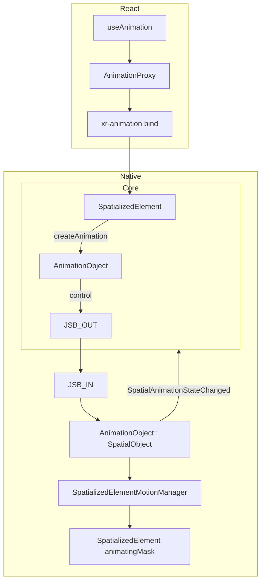

## Context

Declarative motion for three spatialized containers:

- `spatialized2d` — `Spatialized2DElement`
- `static3d` — `SpatializedStatic3DElement`
- `dynamic3d` — `SpatializedDynamic3DElement`

Motion is not a JS ephemeral session but a **native-registered `AnimationObject`**, using the same `SpatialObject` lifecycle as `SpatializedElement`.

## Goals

- `SpatializedElement.createAnimation(config)` creates motion with **timeline locked at create**
- Core exposes `AnimationObject` handle (`play` / `pause` / `resume` / `stop` / `reset` / `finish` / `destroy`)
- Native owns playback state; broadcasts via WebMsg
- Element-level animating mask while playing; **no** Portal suppression
- **Native runtime only**; pure web does not support `useAnimation`
- React creates on bind; pre-bind API queued on Proxy

## Architecture



## Core SDK

### Modules

| Module | Responsibility |
|--------|----------------|
| `AnimationObject` | `SpatialObject` subclass; uuid = native id; subscribes to WebMsg; forwards control JSB |
| `SpatializedElement.createAnimation` | Validate + normalize config → `CreateSpatializedElementAnimation` |
| `validateSpatializedMotionConfig` | Pre-create authoring validation |
| `normalizeMotionConfig` | `from/to`, `timeline` → canonical `tracks` |
| `evaluateMotionTimeline` | Validation alignment tests / initial `style` preview only (not a playback backend) |

**Removed in target state:**

- `SpatializedMotionController`
- `NativePlaybackBackend` / `WebPlaybackBackend`
- `executeAnimateSpatializedElementMotion`
- `AnimateSpatializedElementMotion` JSB

### Interfaces

```typescript
async createAnimation(
  config: SpatializedMotionAuthorConfig,
): Promise<AnimationObject>

class AnimationObject extends SpatialObject {
  readonly elementId: string
  readonly targetKind: SpatializedMotionKind
  play(): Promise<void>
  pause(): Promise<SpatializedVisualValues>
  resume(): Promise<void>
  stop(): Promise<SpatializedVisualValues>
  reset(): Promise<SpatializedVisualValues>
  finish(): Promise<SpatializedVisualValues>
  destroy(): Promise<void>
  readonly playState: SpatializedMotionPlayState
  // ...
}
```

### Timeline lock semantics

1. `createAnimation(config)` → `normalizeMotionConfig` → canonical `tracks`
2. `CreateSpatializedElementAnimation` sends full `timeline` payload
3. Native compiles immutable `TimelineSampler` on `AnimationObject`
4. Control commands carry **no** timeline
5. Config change: `destroy()` then `createAnimation(newConfig)`
6. Lifecycle callbacks registered at `createAnimation`

## Native Runtime

### Modules

| Module | Responsibility |
|--------|----------------|
| `AnimationObject : SpatialObject` | Registry object; locked sampler; play state |
| `SpatializedElementMotionManager` | Shared `CADisplayLink` drives active objects |
| `SpatializedElementMotionTimelineSampler` | Canonical track sampling |
| `SpatializedElementMotionTransformAdapter` | `elementTransform` vs `modelTransform` |

### Element animating mask (replaces Portal suppression)

- `play()` sets per-field mask on parent `SpatializedElement`
- Conflicting `UpdateSpatializedElementTransform` ignored on native during playback
- Mask cleared on terminal commands or `destroy()`
- React does **not** use `PortalInstanceObject` for motion suppression

### Write paths

| targetKind | Sink |
|------------|------|
| `spatialized2d` | `element.transform` + `element.opacity` |
| `static3d` | `modelTransform` (no opacity write) |
| `dynamic3d` | `element.transform` + `element.opacity` |

## JSB Protocol

### JS → Native

**CreateSpatializedElementAnimation** — `elementId`, `targetKind`, `timeline` → `{ animationId }`

**ControlSpatializedElementAnimation** — `animationId`, `type: play|pause|resume|stop|reset|finish`

**Destroy** — existing `Destroy { id: animationId }`

### Native → JS

**SpatialAnimationStateChanged** — `animationId`, `elementId`, `action`, optional `values` / `error`

Core `AnimationObject` treats native broadcast as the **sole** `playState` source.

## React SDK

- `useAnimation` returns `[animation, api, style]`
- `AnimationProxy` queues API until bind + `createAnimation`
- config change → destroy + recreate
- without native: `useAnimation` fails fast

## Playback semantics

Unified across all kinds; terminal callbacks mutually exclusive per session.

## Implementation phases

1. Native `AnimationObject` + Create JSB
2. Core `AnimationObject` + `createAnimation`
3. Control JSB + WebMsg state broadcast
4. Element animating mask; remove Portal suppression
5. React Proxy; remove Web RAF
6. Delete legacy `AnimateSpatializedElementMotion` path
