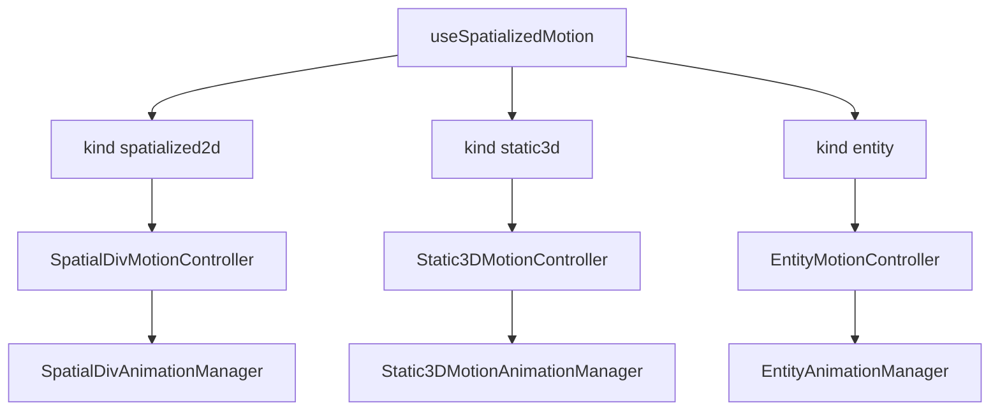

## Context

Three `SpatializedElement` subclasses share scene placement but use **different sync and native write paths**. The 2D motion stack (timeline evaluator, session manager, Portal suppression) lives under `spatialdiv/`. Entity animation uses `EntityAnimationManager` + `AnimateTransform`. Static3D uses `updateProperties({ modelTransform })` and USD clip playback.

This design unifies **author-facing** config (`SpatializedMotionConfig`, `SpatializedSegmentConfig`, `SpatializedPlaybackApi`) and **routes by `kind`** to per-backend controllers.

## Goals

- One timeline config shape across kinds where possible.
- `SpatializedMotionController` (per kind) + `element.motion(config)` factories on Core element classes.
- `useSpatializedMotion({ kind, … })` as the single React entry for declarative timeline motion.
- Umbrella spec with per-kind sub-specs; 2D remains the reference implementation.

## Architecture

## Shared types (Core)

- [`spatializedVisual.ts`](../../packages/core/src/types/spatializedVisual.ts) — values + transform components (aliases from `spatialDivVisual` during migration).
- [`spatializedMotion.ts`](../../packages/core/src/types/spatializedMotion.ts) — timeline, segment, playback API, play state.
- [`spatializedPlayback.ts`](../../packages/core/src/types/spatializedPlayback.ts) — errors.

Entity kind uses **track properties** `position.x` etc.; 2D/Static3D use `transform.translate.x` etc. Validators are per-kind.

## Integration

| Kind | Author outlet | Binding prop |
|------|---------------|--------------|
| 2D | `style` merge | `motion` on `enable-xr` node |
| Static3D | `entityTransform` + opacity via container | `motion` on `<Model>` |
| Entity | `animation` prop on Reality nodes | `animation` (existing) |

## Phased delivery

See [tasks.md](./tasks.md). Phases 2–3 add native timeline payloads parallel to 2D `timeline` on `AnimateSpatialDivCommand` and `AnimateTransformCommand`.
