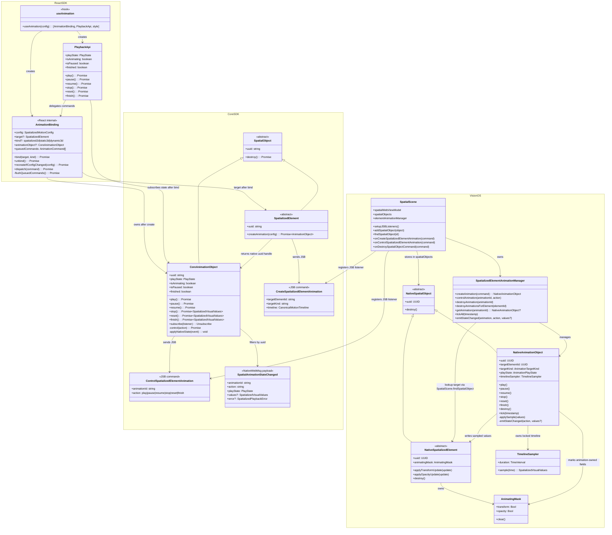
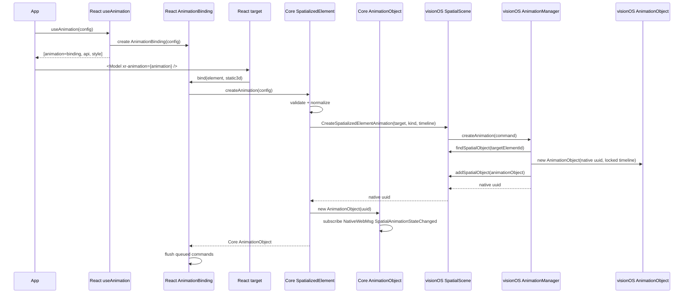
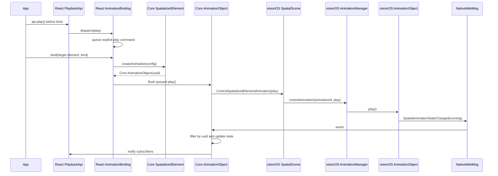
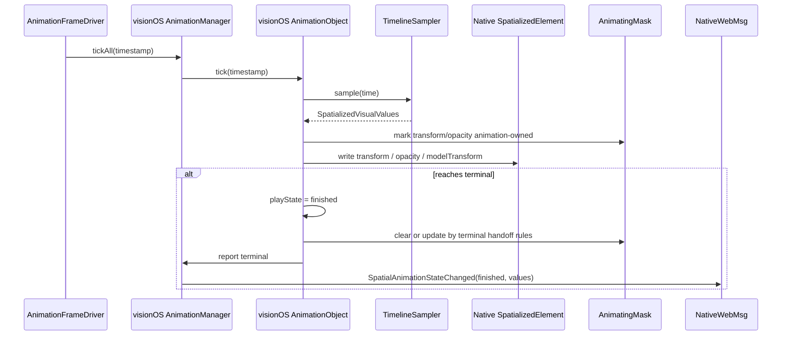
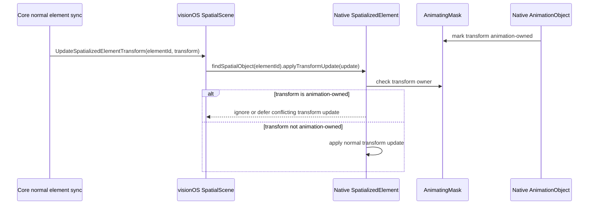
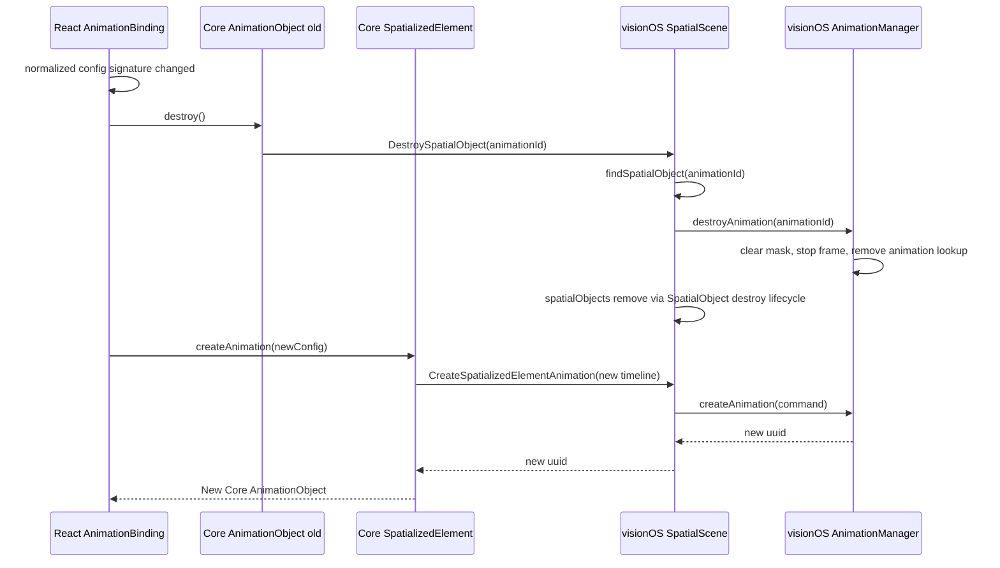

## 背景和目标

本变更为三种空间化容器 kind 定义声明式 motion：

- `spatialized2d`，基于 `Spatialized2DElement`
- `static3d`，基于 `SpatializedStatic3DElement`
- `dynamic3d`，基于 `SpatializedDynamic3DElement`

三者共享同一套 authoring 模型和 canonical `tracks` 执行模型，但在 React 绑定入口和 native 写入路径上不同。Entity 动画保持独立栈，不属于本设计范围。

目标态保留早期 motion 设计中的 playback lifecycle、native frame sampling、animation-owned mask、terminal callback 语义和 `from` / `to` authoring；同时采用 canonical `tracks` timeline、`xr-animation` bind-time target resolution 和 React `style` outlet。

目标态不保留 Web RAF backend。纯 Web runtime 对 spatialized targets 的 `useAnimation` capability 返回 false。

## 目标态架构

目标实现分为 React SDK、Core SDK 和 native runtime 三层：

- React SDK 持有 `AnimationBinding`，由 `useAnimation(config)` 创建。它负责保存 config、bind 前命令排队，并且只在 `xr-animation` 解析到具体 `SpatializedElement` target 后创建 Core `AnimationObject`。
- Core SDK 持有 `AnimationObject extends SpatialObject`。它直接暴露 `play/pause/resume/stop/reset/finish`，继承 `destroy()`，订阅 `NativeWebMsg`，按 native uuid 过滤 `SpatialAnimationStateChanged`，并更新自身可观察状态。
- visionOS 持有 native `AnimationObject extends SpatialObject` 和 `SpatializedElementAnimationManager`。`SpatialScene` 继续作为 JSB listener 注册入口和 native spatial object store owner；manager 只负责 animation 业务生命周期、create/control lookup、element destroy 级联清理、animating mask 协调，以及 `SpatialAnimationStateChanged` 发送。

## 非目标

- 不引入公开的 `AnimationObjectChannel`、`AnimationObjectBridge` 或 `SpatialObjectBridge` 架构对象。
- 不新增独立 `SpatialObjectRegistry`；目标态复用现有 `SpatialScene.spatialObjects`、`addSpatialObject`、`findSpatialObject` 和 destroy path。
- 不新增独立 `JSBCommandHandler`；目标态复用现有 `SpatialScene.setupJSBListeners()` / `spatialWebViewModel.addJSBListener(...)` 入口。
- 不保留 Core/Web RAF playback fallback。
- 不以 `AnimateSpatializedElementMotion` 作为目标态 runtime command。
- 不把 mask ownership 建在 `PortalInstanceObject` 或 React Portal suppression 上。
- 不支持 Static3D root opacity animation；Static3D `opacity` tracks 必须在 native create 前 reject。

## React SDK 模块边界

| 模块 | 职责 |
|------|------|
| `useAnimation(config)` | 创建 `AnimationBinding`、`PlaybackApi` 和 `style` outlet。 |
| `AnimationBinding` | 保存 config、维护 normalized config signature、排队 bind 前显式命令，并在 bind 后创建 Core `AnimationObject`。 |
| `PlaybackApi` | 暴露 React-facing `play/pause/resume/stop/reset/finish`，并订阅 Core `AnimationObject` 状态。 |
| `xr-animation` binding adapter | 解析 concrete target kind，触发 `AnimationBinding.bind()` / `unbind()`。 |

## Core SDK 模块边界

| 模块 | 职责 |
|------|------|
| `SpatializedElement.createAnimation(config)` | 绑定 target 后创建 native-backed `AnimationObject`，负责 validation、normalization 和 create JSB。 |
| `AnimationObject` | Core 一等对象，继承 `SpatialObject`，直接实现播放控制，继承 `destroy()`，直接订阅 NativeWebMsg 并维护自身状态。 |
| `validateSpatializedMotionConfig` | 在 native create 前校验 authoring config，例如 Static3D `opacity` tracks 必须 reject。 |
| `motionConfigToAnimationTimeline` | 将归一化后的 motion config 编译为 canonical `CreateSpatializedElementAnimation` payload。 |

## Native Runtime / visionOS 模块边界

| 模块 | 职责 |
|------|------|
| `SpatialScene JSB listeners` | 复用现有 `SpatialScene.setupJSBListeners()` / `spatialWebViewModel.addJSBListener(...)` 机制注册 animation create/control command，并委托给 `SpatializedElementAnimationManager`。 |
| `SpatializedElementAnimationManager` | 管理 native `AnimationObject` 业务生命周期、`animationId -> NativeAnimationObject` lookup、create/control、`destroyAnimationsForElement`、mask 协调和 `SpatialAnimationStateChanged` 广播。 |
| `Native AnimationObject` | 继承 `SpatialObject`，持有 native uuid、locked `TimelineSampler`、playback state，并实现 `play/pause/resume/stop/reset/finish/tick/destroy`。 |
| `SpatialScene.spatialObjects` | 复用现有 `SpatialScene.spatialObjects` / `addSpatialObject` / `findSpatialObject` / destroy path 注册、查找和销毁 native spatial objects，包括 `AnimationObject`。 |
| `TimelineSampler` | 复用现有 timeline sampler，按 locked canonical timeline 采样。 |
| `AnimationFrameDriver` | 驱动 active animations 的 per-frame tick。 |
| `ElementAnimationWriteAdapter` | 按 target kind 写入 `transform`、`opacity` 或 `modelTransform`。 |
| `AnimatingMask` | 记录 animation-owned fields，防止普通 element sync 覆盖 active animation。 |
| `NativeWebMsgEmitter` | 发送统一 `SpatialAnimationStateChanged`。 |

## 跨层对象关系

## 创建和绑定时序

## Bind 前显式 play 时序

`autoStart: false` 只禁止 implicit play-on-bind，不得丢弃 bind 前显式 `api.play()`。

## 每帧采样与写入

## Mask 冲突处理

Mask 位于 native `SpatializedElement` runtime 或 target write adapter，不依赖 `PortalInstanceObject`。

## Config 变化和销毁

Config 变化不做 hot update；目标态使用 destroy + recreate。`AnimationObject.destroy()` 进入现有 `SpatialObject` destroy 生命周期。

## 现有 visionOS 实现复用策略

| 现有能力 | 复用结论 |
|----------|----------|
| `SpatialScene.setupJSBListeners()` / `spatialWebViewModel.addJSBListener(...)` | 直接复用为 animation create/control command 的注册入口。 |
| `SpatialScene.spatialObjects` / `addSpatialObject` / `findSpatialObject` | 直接复用为 native `AnimationObject` 的通用对象存储与查找机制。 |
| `SpatializedElementMotionTimelineSampler.swift` | 直接复用为 native `AnimationObject` 的 locked sampler。 |
| `SpatializedElementMotionTiming.swift` | 直接复用 timing function / loop config。 |
| `SpatializedElementMotionTransformTypes.swift` | 直接复用 transform components。 |
| `SpatializedElementMotionTransformAdapter.swift` | 改造为 target write adapter；Static3D opacity 仍必须在 create 前 reject。 |
| `SpatializedElementMotionManager.swift` | 重构为 `SpatializedElementAnimationManager`，保留 shared frame driver、查找、terminal values、compose/decompose 思路。 |
| `SpatializedElementMotionSession.swift` | 不保留类；迁移 timing 字段和状态算法到 native `AnimationObject`。 |
| `AnimateSpatializedElementMotionCommand` | 废弃；替换为 `CreateSpatializedElementAnimation` 和 `ControlSpatializedElementAnimation`。 |
| `${animationId}_completed/canceled/failed` WebMsg | 废弃；替换为统一 `SpatialAnimationStateChanged`。 |
