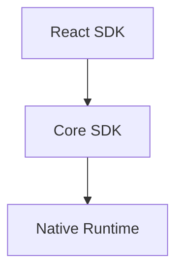
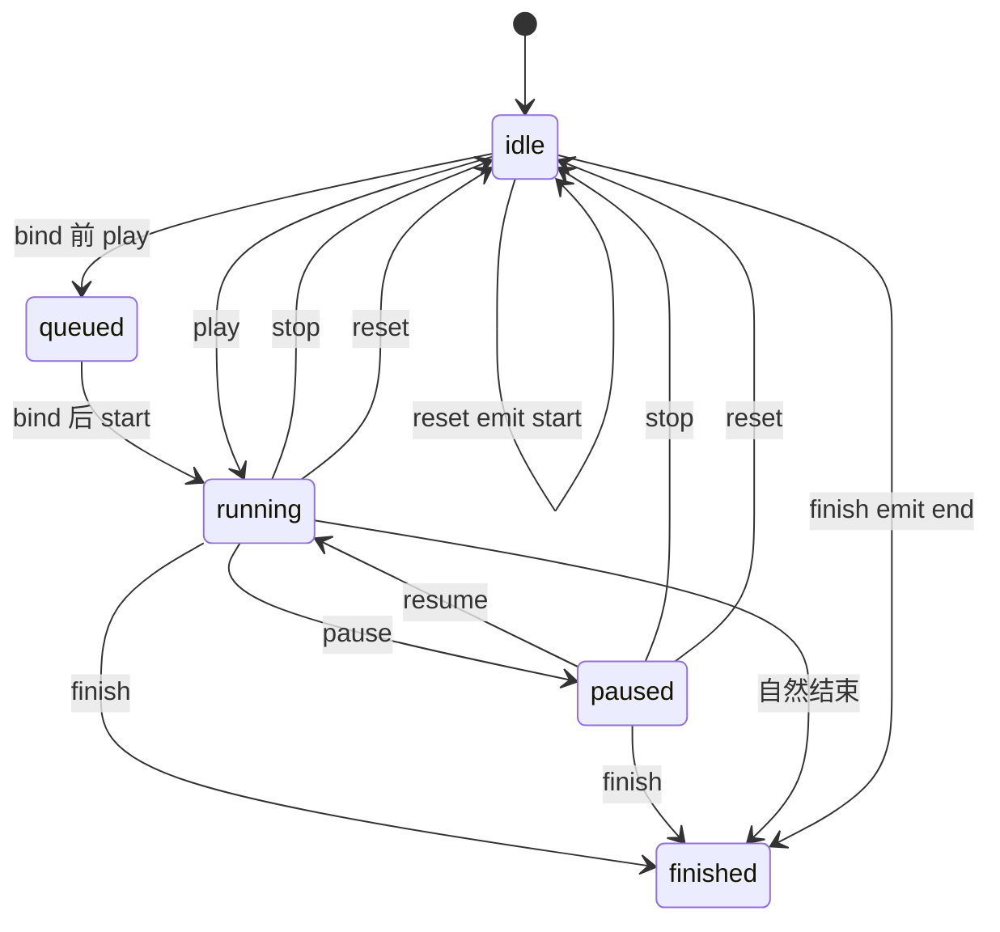

## 背景

本变更为三种空间化容器 kind 定义声明式 motion：

- `spatialized2d`，基于 `Spatialized2DElement`
- `static3d`，基于 `SpatializedStatic3DElement`
- `dynamic3d`，基于 `SpatializedDynamic3DElement`

三者共享同一套 authoring 模型和同一套 canonical `tracks` 执行模型，但在 React 接入点和 native 写入路径上不同。Entity 动画保持独立栈，不属于本目标态设计。

## 设计演进

### Plan A 奠基

Plan A 留下了在本设计中仍然保持规范性的基础原语：

- 会话生命周期和播放状态
- native 控制播放期间的 Portal 抑制
- native 逐帧采样语义
- 生命周期回调互斥
- 以 `from` 和 `to` 表示的单段 authoring 便利形状

### Plan B 泛化

Plan B 引入了通用 timeline 模型：

- 按属性拆分的 canonical `tracks`
- 当 native motion 不可用时，2D 使用 Web RAF
- 以 `style` 作为唯一的 React merge outlet
- 通过 `xr-animation` 在绑定时解析目标

### 统一目标态

本设计将它们整合为单一的三层架构：

- `React SDK` 定义 authoring 和 binding
- `Core SDK` 定义配置归一化、播放语义和 bridge payload
- `Native Runtime` 定义目标特定的播放和写入

## 目标

- 为 2D、Static3D、Dynamic3D 容器 motion 提供统一的 authoring API
- 为所有执行路径提供统一的 canonical timeline 模型
- 为所有 kind 提供统一的 playback API 和回调契约
- 明确区分 React authoring、Core execution、Native playback 三层职责
- 显式说明跨层契约，降低模块职责理解成本

## 架构



## Core SDK

### 模块

| 模块 | 职责 |
|------|------|
| `SpatializedMotionController` | 容器 motion 的 canonical 播放控制器，负责 play state、后端选择、终止命令语义和 suppression 状态。 |
| `evaluateMotionTimeline` | 在 timeline 时间 `t` 采样 canonical `tracks`，应用 `timingFunction`，并组装视觉值。 |
| `validateSpatializedMotionConfig` | 在播放或 native send 前校验 authoring config。 |
| `motionConfigToNativeTimeline` | 将归一化后的 motion config 编译为 canonical native wire payload。 |
| `motionElementBridge` | 将 `play`、`pause`、`resume`、`stop`、`reset`、`finish` 命令从 Core 发送到 native spatialized element，并负责 listener 清理。 |
| `MOTION_KIND_POLICIES` | 编码每种 kind 的 Web RAF 可用性和 suppression 规则。 |

### 接口

#### 配置与数据类型

- `SpatializedMotionConfig`
- `SpatializedMotionSegmentConfig`
- `SpatializedMotionTimelineConfig`
- `SpatializedMotionTrack`
- `SpatializedMotionTimeline`
- `SpatializedVisualValues`
- `SpatializedPlaybackError`

#### 播放接口

`SpatializedPlaybackApi` 定义：

- `play()`
- `pause()`
- `resume()`
- `stop()`
- `reset()`
- `finish()`
- `isAnimating`
- `isPaused`
- `finished`
- `playState`

### 行为

#### 配置归一化

Core 层接受三种互斥的 authoring 形状：

- 通过 `from` 和 `to` 表示的段配置
- 直接给出的 `tracks`
- 百分比 key 的 `timeline`

所有非 track 形状都会在执行前归一化为 canonical `tracks`。对于 `useAnimation` 的 native 播放，始终使用这套 canonical tracks 模型，不得降级到旧版 segment payload。

#### Timeline 评估

`evaluateMotionTimeline` 定义共享插值规则：

- 每条 track 独立采样
- 首个 keyframe 之前使用首值
- 最后一个 keyframe 之后使用末值
- `timingFunction` 按以下顺序解析：
  1. keyframe
  2. track
  3. config
  4. `linear`
- transform 固定按 translate → rotate → scale 组合

#### 播放语义

`SpatializedMotionController` 负责规范性播放行为：

- `play()` 启动播放，或从暂停进度恢复
- 已处于 `running` 时再次调用 `play()` 为 no-op
- `pause()` 会暂停整个 controller 会话；它不接受 keys 或 partial selector
- `resume()` 会恢复整个 controller 会话；它不接受 keys 或 partial selector
- `stop()` 只终止 active session，并冻结当前采样值
- `reset()` 总是跳回起始值，即使当前已处于 idle
- `finish()` 总是跳到终值，即使当前已处于 idle
- `stop()` 和 `reset()` 后 `finished` 变为 `false`
- `finish()` 和自然结束后 `finished` 变为 `true`
- controller state 只表达整体会话；不建模 partially-paused 聚合状态或 pause reason 叠加

#### 后端策略

按 kind 通过 `MOTION_KIND_POLICIES` 选择后端策略：

- `spatialized2d`
  - 允许 Web RAF
  - 具备能力时允许 native
- `static3d`
  - 仅 native
- `dynamic3d`
  - 仅 native

### 边界

Core 层不定义：

- React 组件 API
- JSX binding prop 类型
- native manager 的类内部实现
- Entity motion 行为

## React SDK

### 模块

| 模块 | 职责 |
|------|------|
| `useAnimation` | 公共 authoring hook，返回 `[animation, api, style]`，在 bind-time 之前与目标无关。 |
| `useMotionController` | 将 React 生命周期与 Core controller 连接起来。 |
| `createMotionBinding` | 生成承载延迟目标状态的 opaque `xr-animation` binding 对象。 |
| `createPlaybackApi` | 暴露由 controller 驱动的稳定 React-facing playback surface。 |
| `PortalSpatializedContainer` | 将 2D `xr-animation` 绑定到 `Spatialized2DElement`，并协调 suppression 与 Portal sync。 |
| `Model` | 将 binding target 解析为 `static3d` 的 React 集成点。 |
| `Reality` | 将 binding target 解析为 `dynamic3d` 的 React 集成点。 |

### 接口

#### 公共 hook

`useAnimation(config)` 返回：

- `animation`
- `api`
- `style`

React SDK 面向业务的推荐公开入口保持为 `useAnimation`。`SpatializedMotionController` 与
`SpatializedMotionHandle` 保留在 Core 层作为 imperative utility / internal seam，
不再作为 React SDK 根入口或 motion 子入口的公开导出。

#### 绑定

React 层通过 `xr-animation` prop 定义目标绑定通道：

- `<div enable-xr xr-animation={animation}>`
- `<Model xr-animation={animation}>`
- `<Reality xr-animation={animation}>`

#### Style outlet

`style` 是唯一的 author-facing visual merge outlet：

- 对 `spatialized2d`，`style` 携带 active animated values
- 对 `static3d` 和 `dynamic3d`，`style` 是可安全 spread 的空对象

### 行为

#### 绑定时目标解析

React 层只在 `animation` 真正绑定时解析 controller target：

- `enable-xr` 节点 → `spatialized2d`
- `Model` → `static3d`
- `Reality` → `dynamic3d`

若在 binding 存在前调用 `api.play()`，命令会排队，并在目标解析后开始执行。
这意味着 controller 允许在构造阶段没有 `kind`，但在 backend 真正执行 playback 前，
绑定流程必须已经写入并解析出目标 `kind`。

#### 单绑定约束

一个 binding 实例在同一时刻只能控制一个已挂载 target。如果把同一个 binding 同时传给多个组件，第一次绑定生效，后续绑定发出警告或失败。

#### Style 语义

对于 `spatialized2d`：

- 当 native motion 不可用时，Web RAF 直接驱动 `style` outlet
- 在 native 控制播放期间，`style` 仍是 React merge outlet，但中间态由 suppression 控制 native-owned 字段

对于 `static3d` 和 `dynamic3d`：

- React 不通过 `style` 驱动 root transform 播放
- native 播放由已绑定的 `xr-animation` handle 触发

### 边界

React 层不定义：

- timeline 插值公式
- native 采样算法
- native manager 的实现细节
- entity animation 栈行为

## Native Runtime

### 模块

| 模块 | 职责 |
|------|------|
| `SpatializedElementMotionManager` | 统一的 spatialized element motion native manager，覆盖 2D、Static3D、Dynamic3D。 |
| `SpatializedElementMotionTimelineSampler` | canonical tracks 播放的 native sampler。 |
| `SpatializedElementMotionTransformAdapter` | 屏蔽 `element.transform` 和 `modelTransform` 的目标特定写入差异。 |
| `AnimateSpatializedElementMotion` listener | 接收 motion command 和 timeline payload 的 native JSB 入口。 |

### 接口

#### 命令面

Native 层接收统一的命令族：

- `play`
- `pause`
- `resume`
- `stop`
- `reset`
- `finish`

#### Play payload

`play` payload 携带：

- `animationId`
- `targetKind`
- `elementId`
- `timeline`

其中 `timeline` 是由 Core 发送的 canonical tracks 文档，同时承载
`duration`、逐轨和逐 keyframe 的 `timingFunction`，以及 timeline 级别的
`delay`、`playbackRate`、`loop`。

### 行为

#### 目标特定写入路径

Native 按 kind 将采样值写入不同 sink：

- `spatialized2d` → `element.transform` 和 `opacity`
- `static3d` → `modelTransform` 和 `opacity`
- `dynamic3d` → `element.transform` 和 `opacity`

#### Canonical tracks 执行

Native 必须直接评估 canonical tracks payload。对于该 API，native 播放不得用旧版 `from` 和 `to` 插值路径替换 tracks 执行。

#### 终止命令行为

Native 层必须返回与 Core 语义对齐的值：

- `stop()` 返回当前采样值
- `reset()` 返回起始值
- `finish()` 返回终值
- 自然结束返回终值

#### Native 对齐要求

Native 采样必须在以下方面与 Web evaluator 对齐：

- 逐 track 插值
- hold 行为
- transform 组合顺序
- terminal sampled values

### 边界

Native 层不定义：

- React hook 返回形状
- 面向业务的 config sugar
- entity animation manager 行为
- capability probe API 形状

## 跨层契约

### React SDK 到 Core SDK

React 层通过以下入口将 authoring config 和生命周期传给 Core：

- `useAnimation(config)`
- `createMotionBinding`
- `createPlaybackApi`

Core 仍然是 normalized config、play state 和 terminal command semantics 的唯一所有者。

#### Hook 元组契约

```typescript
type UseAnimationResult = readonly [
  animation: SpatializedMotionBindingInternal,
  api: SpatializedPlaybackApi,
  style: CSSProperties,
]
```

- `animation` 是通过 `xr-animation` 传递的 opaque binding handle
- `api` 是由 Core 驱动的稳定 imperative playback surface
- `style` 是唯一的面向业务的 visual outlet

#### Binding 契约

```typescript
interface SpatializedMotionBindingInternal {
  readonly __kind: 'spatializedMotion'
  readonly __propName: 'xr-animation'
  readonly __motionObjectId: string
  get __animating(): boolean
  readonly __suppressedFields: Set<string> | null
  __getSuppressedFields(): Set<string> | null
  __setElement?: (
    element: HTMLElement | Spatialized2DElement | SpatializedStatic3DElement | SpatializedDynamic3DElement | null,
    targetKind?: 'spatialized2d' | 'static3d' | 'dynamic3d',
  ) => void
  __onUnbind?: () => void
}
```

- React 负责该对象的创建和挂载期接线
- Core 负责其背后的 motion object identity、animating state 和 suppression state
- 应用将其视为 opaque，只通过 `xr-animation` 透传

### Core SDK 到 Native Runtime

Core 层通过 bridge 发送 canonical motion commands：

- `AnimateSpatializedElementMotion`
- canonical `timeline` payload
- `stop`、`reset`、`finish` 的 terminal commands

#### 命令契约

```typescript
interface AnimateSpatializedElementMotionCommand {
  animationId: string
  type: 'play' | 'pause' | 'resume' | 'stop' | 'reset' | 'finish'
  targetKind: 'spatialized2d' | 'static3d' | 'dynamic3d'
  elementId?: string
  timeline?: SpatializedMotionTimeline
}
```

- 对目标态 `useAnimation` 路径，`play` 使用 `timeline` 作为 canonical execution document
- `play` 通过 JSB 是 timeline-only 的；顶层时序控制字段不属于稳定 wire 契约
- `targetKind` 由 Core 在 React 绑定时完成目标解析后填充
- controller 级 `pause` 和 `resume` 只支持整体会话控制；未来如需局部 track/action 控制，必须另起一个新 change 设计独立 API

#### Canonical timeline payload

```typescript
interface SpatializedMotionTimeline {
  duration: number
  delay?: number
  playbackRate?: number
  loop?: boolean | { reverse?: boolean }
  tracks: Array<{
    property: SpatializedMotionProperty
    keyframes: Array<{
      at: number
      value: number
      timingFunction?: TimingFunction
    }>
    timingFunction: TimingFunction
  }>
}
```

- 这是目标态容器 motion 唯一稳定的跨层播放文档
- segment 风格的 `from` 和 `to` authoring 必须在 native send 前编译为该形状
- timeline 级别的 `delay`、`playbackRate`、`loop` 都位于该 payload 内部，而不是外层命令上

### Native Runtime 到 Core SDK

Native 层返回：

- complete values
- stop values
- reset values
- finish values
- async playback errors

Core 再将这些值转发给 React-facing callbacks 和 style 更新。

#### Play handle 契约

```typescript
interface AnimateSpatializedElementMotionResult {
  animationId: string
  finished: Promise<SpatializedVisualValues>
  canceled: Promise<SpatializedVisualValues>
  failed: Promise<SpatializedPlaybackError>
}
```

- `finished` 在自然完成时 resolve 为终值
- `canceled` 在统一 manager 暴露的终止中断路径上 resolve 为采样值
- `failed` resolve 为 async playback error payload

#### Terminal value 契约

对已启动播放后的终止命令：

- `stop()` 返回当前采样值
- `reset()` 返回起始值
- `finish()` 返回终值

Core 消费这些值，并将其作为以下语义的来源：

- `onStop(values)`
- `onReset(values)`
- `finish()` 场景下的 `onComplete(values)`
- 终态切换后的 style 同步

#### Error 契约

```typescript
interface SpatializedPlaybackError {
  animationId: string
  command: 'play' | 'pause' | 'resume' | 'stop' | 'reset' | 'finish'
  code?: string
  reason: string
}
```

- Native 负责 async failure source
- Core 负责将错误分发到 callbacks 或 logging

## 共享语义

### 播放状态



### 生命周期回调

所有 kind 共享同一套回调契约：

| 回调 | 触发条件 | 值 |
|------|---------|----|
| `onStart` | 播放真正开始后的首帧 | 无 |
| `onComplete` | 自然结束或 `finish()` | 终值 |
| `onStop` | `stop()` | 当前采样值 |
| `onReset` | `reset()` | 起始值 |
| `onError` | async native failure | `SpatializedPlaybackError` |

每条终止路径中，`onComplete`、`onStop`、`onReset` 恰好触发一个。

### Suppression

Portal suppression 仍然是共享的跨层规则：

- `opacity` track 仅抑制 `opacity` 同步
- 任意 `transform.*` track 抑制 transform 整体同步
- 在 terminal state 或 unbind 时释放 suppression

## 非目标

本设计不覆盖：

- Entity animation convergence
- Material 或 variant animation
- Layout field animation
- Physics 或 spring simulation
- 任意 transform string interpolation

## 交付说明

本文档描述目标态设计和模块边界。交付历史、phase 顺序和迁移进展继续由 [tasks.md](./tasks.md) 维护。
