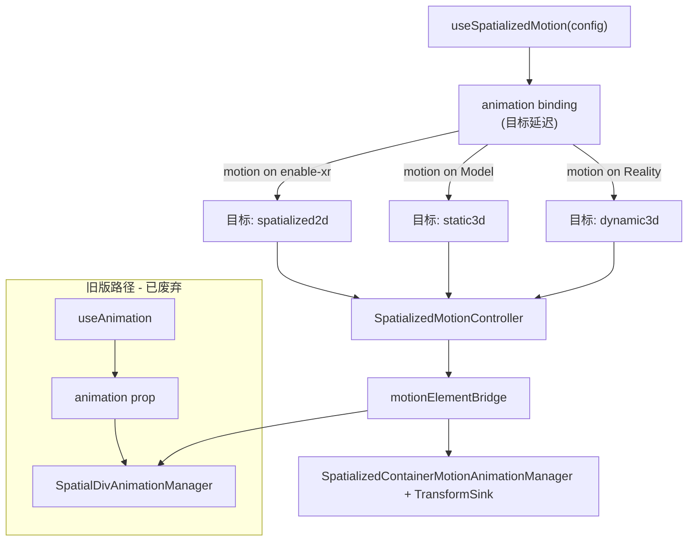

## 背景

三个 `SpatializedElement` 子类共享场景定位，但使用**不同的 native 写入路径**。Timeline 评估器、会话状态机和 Portal 抑制逻辑在 TypeScript 中共享；native 将采样结果应用到 `element.transform`（2D / Dynamic3D）或 `modelTransform`（Static3D）。Entity 动画保持**独立**栈（`useAnimation` + `EntityAnimationManager`）。

本设计统一了**面向开发者**的配置（`SpatializedMotionConfig`、`SpatializedSegmentConfig`、`SpatializedPlaybackApi`），并通过**绑定目标**（`animation` 被传给哪个组件的 `motion` prop 时自动确定）路由到单一 Core 控制器和单一 React hook。

## 设计演进

### Plan A（会话动画）— 奠基

Plan A 确立了架构原语：
- **会话状态机**：idle → queued → delaying → running → paused → finished/canceled
- **Portal 抑制**：opacity 属性级、transform 字段整体级
- **Native 播放模型**：visionOS 上 CADisplayLink 驱动的逐帧采样
- **生命周期契约**：onStart/onComplete/onCancel/onError 互斥
- **段插值**：单次 `from`/`to` + timing function

这些在统一系统中保持规范性。

### Plan B（Motion Timeline）— 泛化

Plan B 扩展了架构：
- **Timeline 数据模型**：按属性的 track + 绝对时间 keyframe（灵感来自 Three.js AnimationClip）
- **双后端**：native 不可用时 Web RAF，WebSpatial 运行时走 native timeline
- **Style outlet**：回传给业务侧、用于 React 状态驱动渲染的 `style` 对象；Plan B 同时将 binding 从 `animation` 更名为 `motion`
- **多 kind 支持**：基于策略的路由，覆盖 spatialized2d / static3d / dynamic3d

### 统一架构（本设计）

合并将两者整合为单一规范系统，同时保持向后兼容。

## 目标

- 2D / Static3D / Dynamic3D 三种容器 kind 共享一种 timeline 配置形状。
- **一个** Core 实现：`SpatializedMotionController`（按 `kind` 策略）+ 各 element 类上的 `element.motion(config)`。
- **一个** React 入口：`useSpatializedMotion(config)` 接受 `from/to` 或 `tracks`（互斥 union）。目标在绑定时解析（config 中无 `kind`）。内部 `from/to` 编译为 `tracks`。
- 旧版 `useAnimation` + `animation` prop 作为 2D 废弃路径保留。
- 伞式 spec + 按 kind 子 spec；2D 为 Web RAF + 抑制行为的参考。

## 架构

## Core 模块

| 模块 | 角色 |
|------|------|
| `SpatializedMotionController` | 单一 TS 控制器；由绑定目标选择能力 token、Web RAF vs 仅 native、被抑制字段 |
| `motionElementBridge` | 分发 `animateSpatialDiv` vs `animateMotion` + 监听器清理 |
| `element.motion(config)` | 各 `Spatialized*Element` 上的工厂；返回匹配目标 kind 的 `SpatializedMotionController` |
| `evaluateMotionTimeline` | 共享 Web 评估器：逐轨采样、easing、lerp |
| `SpatialDivTimelineEvaluator`（Swift） | Native 对等评估器：逐轨 90Hz 采样（CADisplayLink） |
| `SpatializedMotionTransformSink` | 抽象写入路径（elementTransform vs modelTransform），用于 Static3D/Dynamic3D |

## React 模块

| 模块 | 角色 |
|------|------|
| `useSpatializedMotion` | 公共 hook（tuple 返回 `[animation, api, style]`）；接受 `from/to` 或 `tracks` 配置；绑定前与目标无关 |
| `useMotionController` + `createMotionBinding` + `createPlaybackApi` | 共享接线 |

## 共享类型（Core）

- `spatializedVisual.ts` — 值 + transform 分量
- `spatializedMotion.ts` — timeline、segment、playback API、play state、`SpatializedMotionKind`
- `spatializedPlayback.ts` — 错误

## 集成矩阵

| Kind | React outlet | 绑定 prop | Native 写入路径 | Web RAF |
|------|--------------|-----------|----------------|---------|
| 2D | `style` | `motion` 在 `enable-xr` 节点上 | `element.transform` + opacity + DOM | 有 |
| Static3D | `style` 未使用 | `motion` 在 `<Model>` 上 | `modelTransform` + opacity | 无 |
| Dynamic3D | `style` 未使用 | `motion` 在 `<Reality>` 上 | `element.transform` + opacity | 无 |

## 目标解析（Target Resolution）

`useSpatializedMotion` 返回的 `animation` binding 与**目标无关**。目标在绑定时解析：

1. React 组件接收 `motion={animation}` prop。
2. 组件类型决定目标：`enable-xr` → `spatialized2d`、`<Model>` → `static3d`、`<Reality>` → `dynamic3d`。
3. Controller 激活匹配的 `MOTION_KIND_POLICIES` 条目。
4. 对于 2D：`style` outlet 由 Web RAF 或 native 采样主动驱动。对于 3D：`style` 保持 `{}`。

**绑定前播放：** 若在 binding 挂载前调用 `api.play()`，命令被排队。目标解析后播放开始。

**单绑定约束：** 一个 binding 实例 MUST NOT 同时传给多个组件。第一次绑定生效；后续绑定 MUST 警告/抛错。

## 旧版兼容

Plan A 路径（`useAnimation` + `animation` prop）作为薄兼容层保留：

1. 用于 SpatialDiv 的 `useAnimation(config)` 继续正常工作。
2. 内部实现中，简单配置 MAY 被编译为相同的 native 段命令。
3. `animation` prop 路径不使用 `SpatializedMotionController`；保留自有会话管理。
4. 新代码 SHOULD 使用 `useSpatializedMotion({ from, to, duration })`，提供相同的单段体验。

## Portal 抑制（统一规则）

| 被动画字段 | 抑制范围 | 释放触发 |
|-----------|---------|---------|
| `opacity` | 属性级：仅 `opacity` 同步被抑制 | 会话终态（finished/canceled） |
| 任何 `transform.*` | Transform 整体级：整个 `updateTransform(matrix)` 被抑制 | 会话终态 |

抑制同时适用于旧版 `animation` prop 会话和 `motion` binding 会话。

## Native Timeline 评估

Native MUST 在 timeline 时间 `t`（秒，经 `delay` 和 `playbackRate` 处理后）独立采样每个 track，以固定顺序（translate → rotate → scale）组合 transform，产生与 Web 评估器在容差内一致的结果（translate ±0.5 px，opacity/scale ±0.01）。

## 分阶段交付

见 [tasks.md](./tasks.md)。概要：
- Phase 0–1：伞式 spec + 统一命名（已完成）
- Phase 2：Static3D + Dynamic3D native timelines（已完成）
- Phase 3：Core + React 合并（已完成）
- Phase 4：Entity timeline（推迟）
- Phase 5：Native 合并（已完成）
- Phase 6：统一 JSB + 类型重命名（已完成）
- Phase 7：Spec 合并（本次提交）
