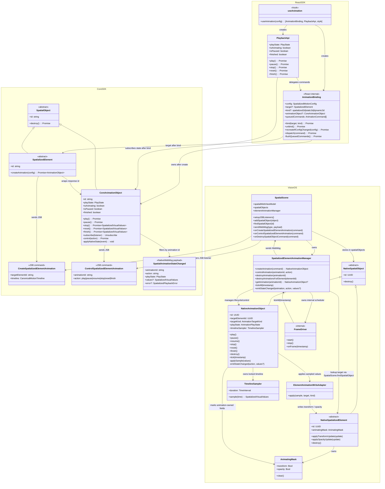
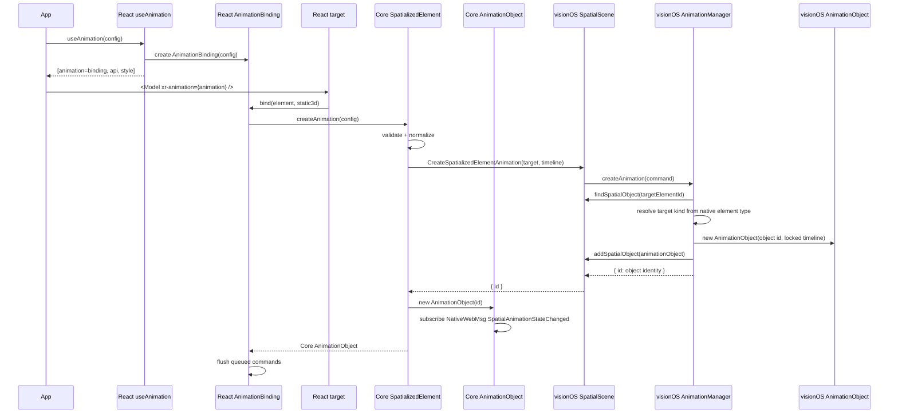
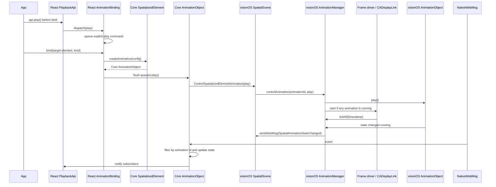
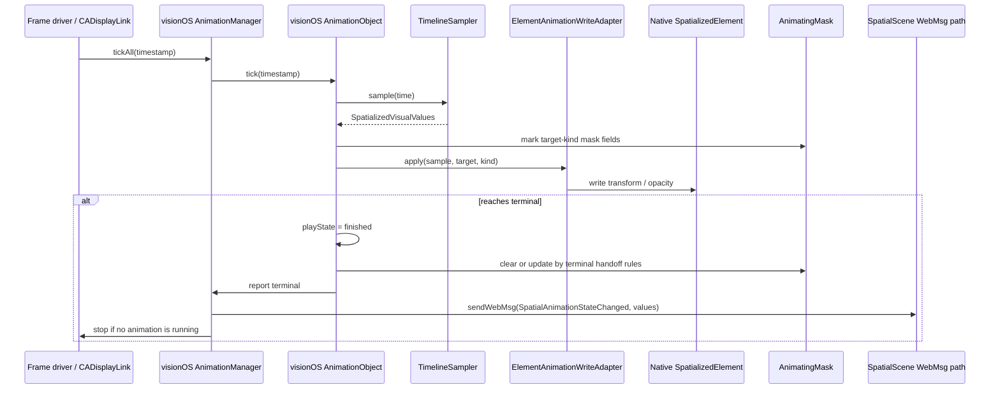
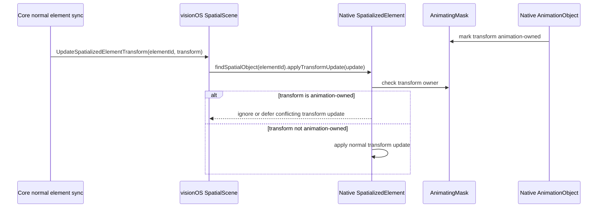
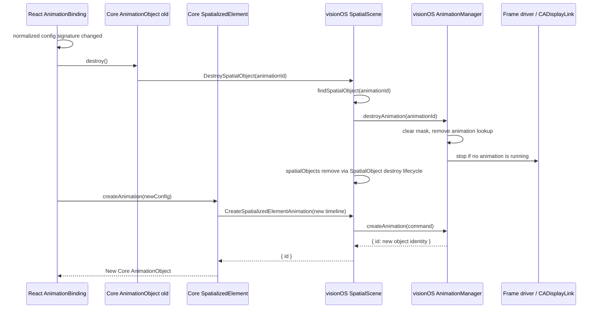

## 背景和目标

本变更为三种空间化容器 kind 定义声明式 motion：

- `spatialized2d`，基于 `Spatialized2DElement`
- `static3d`，基于 `SpatializedStatic3DElement`
- `dynamic3d`，基于 `SpatializedDynamic3DElement`

三者共享同一套公开 segment/timeline authoring 模型和内部 canonical `tracks` 执行模型，但在 React 绑定入口和 native 写入路径上不同。Entity 动画保持独立栈。

本设计定义 playback lifecycle、native frame sampling、animation-owned mask、terminal callback 语义、公开 segment/timeline authoring、内部 canonical `tracks`、`xr-animation` bind-time target resolution 和 React `style` outlet。

## 架构

实现分为 React SDK、Core SDK 和 native runtime 三层：

- React SDK 从 `@webspatial/react-sdk/experimental` 导出 ready-gated `useAnimation` 和 `useEntityAnimation` facade。React SDK 持有 `AnimationBinding`，由 `useAnimation(config)` 创建。它负责保存 config、bind 前命令排队，并且只在 `xr-animation` 解析到具体 `SpatializedElement` target 后创建 Core `AnimationObject`。
- Core SDK 持有 `AnimationObject extends SpatialObject`。它解析播放控制，继承 `destroy()`，订阅 `NativeWebMsg`，按匹配的 animation identity 过滤 `SpatialAnimationStateChanged`，并更新自身可观察状态。
- visionOS 持有 native `AnimationObject extends SpatialObject` 和 `SpatializedElementAnimationManager`。`SpatialScene` 注册 JSB listener 并存储 native spatial object；manager 负责 animation 业务生命周期、create/control lookup、frame loop 调度、element destroy 级联清理、animating mask 协调，以及构造 `SpatialAnimationStateChanged` 并通过 WebMsg 路径发送。

## 公开 authoring 与内部表示

实验性的 `useAnimation(config)` 输入接受顶层 `from` / `to` segment authoring 或 `timeline` 对象。顶层分支要求两个边界都存在；timeline 分支将边界放在 `timeline` 内，对顶层边界没有要求。Timeline 可以混合使用 `from`、`to` 和百分比关键帧。存在 timeline 时，Core 在 validation 和 normalization 前丢弃任何顶层 `from` 和 `to`。公开 `tracks` authoring 仍然非法。

Core 将 timeline `from` 视为 0%、将 `to` 视为 100%，与百分比 entry 合并，并把每个属性独立归一化为使用绝对时间关键帧的数值 track。属性 track 可以晚于 time zero 开始或早于 duration 结束，但必须至少包含两个关键帧。首个关键帧之前的采样保持首值，最后一个关键帧之后的采样保持末值。同一属性同时声明在 `from` 和 `0%`，或同时声明在 `to` 和 `100%` 时，validation 将其作为重复边界拒绝。Track、keyframe、property path、归一化 timeline 与 native wire 类型仅属于内部实现：稳定包入口不导出这些类型，`useAnimation` 不接受它们，公开文档不把它们作为 authoring API，也不提供 experimental 入口。

Core 向 native 发送完全解析的数值 tracks，因此现有 native timeline sampler contract 保持不变。

## React SDK 模块边界

| 模块 | 职责 |
|------|------|
| `useAnimation(config)` | 创建 `AnimationBinding`、`PlaybackApi` 和 `style` outlet。 |
| `AnimationBinding` | 保存 config、维护 normalized config signature、排队 bind 前显式命令，并在 bind 后创建 Core `AnimationObject`。 |
| `PlaybackApi` | 暴露 React-facing `play/pause/stop/reset/finish`，并订阅 Core `AnimationObject` 状态。`play()` 在会话 paused 时恢复，在 running 时为 no-op。 |
| `xr-animation` binding adapter | 解析 concrete target kind，触发 `AnimationBinding.bind()` / `unbind()`。 |

`style` outlet 是 `useAnimation(config)` 在 React 侧提供的视觉状态闭环输出。开发者 MUST 将其合并到接收 `xr-animation` 的同一个宿主上，以便后续 rerender 或 resync 读取到与动画会话最后一次发出的视觉状态一致的值。`style` outlet 不是 native-backed animation 的运行时 playback source；实际播放仍由 native `AnimationObject` 驱动。

## Core SDK 模块边界

| 模块 | 职责 |
|------|------|
| `SpatializedElement.createAnimation(config)` | 绑定 target 后创建 native-backed `AnimationObject`，负责 validation、normalization 和 create JSB；native response 以 `{ id }` 返回新建对象的 identity。 |
| `AnimationObject` | Core 一等对象，继承 `SpatialObject`，直接实现播放控制，继承 `destroy()`，直接订阅 NativeWebMsg 并维护自身状态。 |
| `validateSpatializedMotionConfig` | 应用 timeline 优先级，拒绝重复边界声明，并校验生成的内部 track 至少包含两个关键帧，包括 Static3D `opacity`。 |
| `motionConfigToAnimationTimeline` | 将归一化后的 motion config 编译为 canonical `CreateSpatializedElementAnimation` payload。 |

## Native Runtime / visionOS 模块边界

| 模块 | 职责 |
|------|------|
| `SpatialScene JSB listeners` | `SpatialScene.setupJSBListeners()` / `spatialWebViewModel.addJSBListener(...)` 注册 animation create/control command，并委托给 `SpatializedElementAnimationManager`。 |
| `SpatializedElementAnimationManager` | 管理 native `AnimationObject` 业务生命周期、`animationId -> NativeAnimationObject` lookup、create/control、frame loop 启停、`destroyAnimationsForElement`、mask 协调，并构造 `SpatialAnimationStateChanged` payload。 |
| `Native AnimationObject` | 继承 `SpatialObject`，持有 object identity、locked `TimelineSampler` 和 playback state，并实现 `play/pause/resume/stop/reset/finish/tick/destroy`；`reset/finish` 在同一个对象上操作，不重建。 |
| `SpatialScene.spatialObjects` | `SpatialScene.spatialObjects` / `addSpatialObject` / `findSpatialObject` / destroy path 注册、查找和销毁 native spatial objects，包括 `AnimationObject`。 |
| `TimelineSampler` | 按 locked canonical numeric timeline 采样。 |
| `Frame driver / CADisplayLink` | `SpatializedElementAnimationManager` 的内部调度能力；manager 在存在 running animation 时启动它，由它每帧回调 `manager.tickAll(timestamp)`，driver 本身不持有 animation 语义。 |
| `ElementAnimationWriteAdapter` | 由 `Native AnimationObject.tick()` 调用，根据 target kind 写入容器根 `transform` 和 `opacity`；manager 不执行逐属性写入。 |
| `AnimatingMask` | 记录 animation-owned fields，防止普通 element sync 覆盖 active animation。 |
| `SpatialScene WebMsg send path` | `SpatialScene` / `spatialWebViewModel` 发送统一 `SpatialAnimationStateChanged`。 |

## target kind 字段映射

| target kind | writable fields | mask fields |
|-------------|-----------------|-------------|
| `spatialized2d` | `transform`, `opacity` | `transform`, `opacity` |
| `dynamic3d` | `transform`, `opacity` | `transform`, `opacity` |
| `static3d` | `transform`, `opacity` | `transform`, `opacity` |

Static3D `transform` 和 `opacity` tracks 必须在 native create 中被保留。Static3D animation 写 `SpatializedStatic3DElement` 容器根 `transform` 和 `opacity`；不得写模型内部 `entityTransform` / `modelTransform` 字段，也不得影响 USD embedded clip playback。

## 跨层对象关系

## 创建和绑定时序

`CreateSpatializedElementAnimation` 只创建 native animation object 并锁定完全解析的数值 timeline。除非后续有 implicit play-on-bind 或 bind 前显式 `play` 被 flush，create 本身不启动 frame sampling。

## 播放控制与对象生命周期

`play`、`pause`、`stop`、`reset` 和 `finish` 都作用于同一个已经创建的 `AnimationObject`。`play()` 在 idle 时开始会话，在 paused 时恢复，在 running 时为 no-op。这些 playback controls 不重建 native object，也不改变 object id。

只有 config signature 变化、target 重新绑定、显式 `destroy()` 后重新创建，或 element destroy 级联清理，才进入 destroy + recreate 生命周期。`reset()` 写入 time zero 处的 timeline sample，`finish()` 写入 duration 处的 sample；因此 sparse property track 分别使用首值和末值。二者都作用于当前 native `AnimationObject`。

## Bind 前显式 play 时序

`autoStart: false` 只禁止 implicit play-on-bind，不得丢弃 bind 前显式 `api.play()`。

`api.finish()` 语义是分段的：bind 前它只表示显式排队意图，因此公开可见状态必须保持 `queued` 且 `finished=false`；native-backed `AnimationObject` 创建后会 flush 这条命令，随后只有 native 确认终态时才进入 `finished`。

## Frame loop 生命周期

`Frame driver / CADisplayLink` 是 `SpatializedElementAnimationManager` 的内部调度能力，底层可由 `CADisplayLink` 等平台 frame callback 实现。driver 只负责向 manager 提供每帧 timestamp，不持有 animationId、target element、timeline、playback state 或 WebMsg 发送职责。

当 control command 使至少一个 `Native AnimationObject` 进入 `running` 时，manager 启动 frame loop，包括 `play` 和 `resume`。在 `pause`、`stop`、`reset`、`finish`、`destroy`、自然完成、`destroyAnimationsForElement`、scene/page cleanup 之后，manager 必须检查 frame loop 是否可以停止。当不存在 running native animation object 时，frame loop 必须停止。

## 每帧采样与写入

## Mask 冲突处理

Mask 位于 native `SpatializedElement` runtime 或 target write adapter。

## Terminal mask handoff

| action | value write | mask handoff |
|--------|-------------|--------------|
| `pause` | 保留当前 sampled value | 保留 mask，因为 animation 仍拥有该视觉字段 |
| `stop` | 写入当前 sampled value | 释放本 animation 拥有的 mask fields |
| `reset` | 写入 time zero 处的 sample | 释放本 animation 拥有的 mask fields |
| `finish` | 写入 duration 处的 sample | 释放本 animation 拥有的 mask fields |
| natural completion | 写入 duration 处的 sample | 释放本 animation 拥有的 mask fields |
| `destroy` | 不额外强制写入终态；清理 animation | 释放本 animation 拥有的 mask fields |

## Config 变化、销毁和级联清理

Config 变化使用 destroy + recreate。`AnimationObject.destroy()` 进入 `SpatialObject` destroy 生命周期。

当 target `SpatializedElement` 销毁时，native runtime 必须通过 `SpatializedElementAnimationManager.destroyAnimationsForElement(elementId)` 销毁所有关联 `AnimationObject`。该流程必须进入每个 animation object 的 destroy lifecycle，不得只从 manager lookup 中删除对象。
