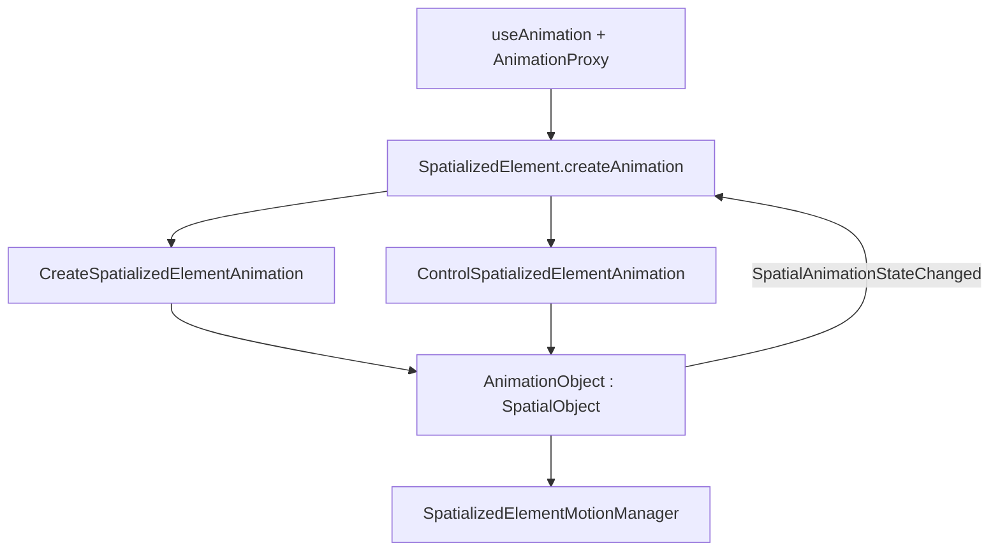

## 架构



## Core

```typescript
element.createAnimation(config): Promise<AnimationObject>
animationObject.play() | pause() | resume() | stop() | reset() | finish() | destroy()
```

移除：`SpatializedMotionController`、`WebPlaybackBackend`、`NativePlaybackBackend`、`AnimateSpatializedElementMotion`。

## Native

- `AnimationObject : SpatialObject` — uuid 在 create 时分配，锁定 `TimelineSampler`
- `SpatializedElementMotionManager` — 共享 `CADisplayLink`
- `TransformAdapter` — 2D/Dynamic3D → `element.transform`；Static3D → `modelTransform`
- **animating mask** — 播放中忽略冲突 transform JSB

## JSB

**Create** — `{ elementId, targetKind, timeline }` → `{ animationId }`

**Control** — `{ animationId, type: play|pause|resume|stop|reset|finish }`

**WebMsg** — `SpatialAnimationStateChanged { animationId, elementId, action, values?, error? }`

**Destroy** — 通用 `Destroy { id }`

## React

1. `useAnimation(config)` → Proxy
2. bind → `createAnimation` → flush 排队命令
3. unmount → `destroy`
4. config 变 → destroy + recreate
5. 无 native → fail-fast

## 实现阶段

见 [tasks.zh.md](./tasks.zh.md)
