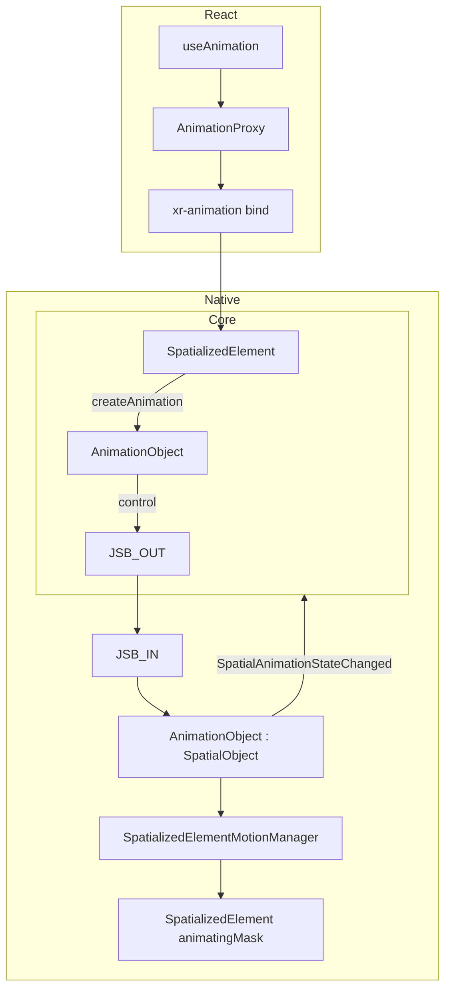

## 背景

本变更为三种空间化容器定义声明式 motion：

- `spatialized2d` — `Spatialized2DElement`
- `static3d` — `SpatializedStatic3DElement`
- `dynamic3d` — `SpatializedDynamic3DElement`

动画不是 JS 侧 ephemeral session，而是 **Native 注册的 `AnimationObject`**，与 `SpatializedElement` 等一样走统一 `SpatialObject` 生命周期。

## 目标

- `SpatializedElement.createAnimation(config)` 创建动画，**timeline 在创建时锁定**
- Core 暴露 `AnimationObject` 句柄（`play` / `pause` / `resume` / `stop` / `reset` / `finish` / `destroy`）
- Native 独占播放状态，通过 WebMsg 广播
- Element 级 animating mask，播放时忽略冲突 JSB 写入；**不**依赖 Portal suppression
- **仅 native runtime**；纯 Web 不支持 `useAnimation`
- React 在 bind 时 create；bind 前 API 由 Proxy 排队

## 架构



## Core SDK

### 模块

| 模块 | 职责 |
|------|------|
| `AnimationObject` | `SpatialObject` 子类；uuid = native id；订阅 WebMsg 状态；转发控制 JSB |
| `SpatializedElement.createAnimation` | 校验 + 归一化 config → `CreateSpatializedElementAnimation` |
| `validateSpatializedMotionConfig` | 创建前校验 authoring config |
| `normalizeMotionConfig` | `from/to`、`timeline` → canonical `tracks` |
| `evaluateMotionTimeline` | 仅用于校验对齐测试 / 初始 `style` 预览（非播放后端） |

**移除（目标态不得存在）：**

- `SpatializedMotionController`
- `NativePlaybackBackend` / `WebPlaybackBackend`
- `executeAnimateSpatializedElementMotion`
- `AnimateSpatializedElementMotion` JSB

### 接口

```typescript
// SpatializedElement
async createAnimation(
  config: SpatializedMotionAuthorConfig,
): Promise<AnimationObject>

// AnimationObject — id 由 native 在 create 时分配
class AnimationObject extends SpatialObject {
  readonly elementId: string
  readonly targetKind: SpatializedMotionKind

  play(): Promise<void>
  pause(): Promise<SpatializedVisualValues>
  resume(): Promise<void>
  stop(): Promise<SpatializedVisualValues>
  reset(): Promise<SpatializedVisualValues>
  finish(): Promise<SpatializedVisualValues>
  destroy(): Promise<void>

  readonly playState: SpatializedMotionPlayState
  readonly isAnimating: boolean
  readonly isPaused: boolean
  readonly finished: boolean
}
```

### Timeline 锁定语义

1. `createAnimation(config)` 调用 `normalizeMotionConfig` → canonical `tracks`
2. `CreateSpatializedElementAnimation` 发送完整 `timeline` payload
3. Native 编译 `TimelineSampler` 并绑定到 `AnimationObject`（不可变）
4. `play()` / `pause()` / … **不**携带 timeline
5. 修改 config：**先** `animation.destroy()`，**再** `element.createAnimation(newConfig)`
6. 生命周期回调（`onStart`、`onComplete` 等）在 `createAnimation` 时注册

## Native Runtime

### 模块

| 模块 | 职责 |
|------|------|
| `AnimationObject : SpatialObject` | 注册表对象；持有锁定 sampler；暴露 play state |
| `SpatializedElementMotionManager` | 共享 `CADisplayLink` 驱动所有 active `AnimationObject` |
| `SpatializedElementMotionTimelineSampler` | canonical tracks 逐帧采样 |
| `SpatializedElementMotionTransformAdapter` | `elementTransform` vs `modelTransform` 写入路径 |

### Element animating mask（替代 Portal suppression）

- `AnimationObject.play()` → 在 parent `SpatializedElement` 上设置 per-field mask（`transform` / `opacity`）
- 播放期间 `UpdateSpatializedElementTransform` 及冲突 property 更新在 **native 侧忽略**（或 log warn）
- 终态命令或 `destroy()` 清除 mask
- React **不**通过 `PortalInstanceObject` 做 motion field suppression

### 写入路径

| targetKind | Sink |
|------------|------|
| `spatialized2d` | `element.transform` + `element.opacity` |
| `static3d` | `modelTransform`（不写入 opacity） |
| `dynamic3d` | `element.transform` + `element.opacity` |

## JSB 协议

### JS → Native

**CreateSpatializedElementAnimation**

```typescript
{
  commandType: 'CreateSpatializedElementAnimation'
  elementId: string
  targetKind: 'spatialized2d' | 'static3d' | 'dynamic3d'
  timeline: SpatializedMotionTimeline  // duration, delay, loop, playbackRate, tracks[]
}
→ { animationId: string }  // native uuid
```

**ControlSpatializedElementAnimation**

```typescript
{
  commandType: 'ControlSpatializedElementAnimation'
  animationId: string
  type: 'play' | 'pause' | 'resume' | 'stop' | 'reset' | 'finish'
}
→ pause/stop/reset/finish: { values: SpatializedVisualValues }
→ play: void
```

**Destroy** — 现有 `Destroy { id: animationId }`

### Native → JS（WebMsg）

```
SpatialAnimationStateChanged
{
  animationId: string
  elementId: string
  action: 'started' | 'paused' | 'resumed' | 'stopped' | 'reset' | 'finished' | 'completed' | 'failed'
  values?: SpatializedVisualValues
  error?: { command: string; reason: string }
}
```

Core `AnimationObject` 以 native 广播为 `playState` **唯一来源**。

## React SDK

### `useAnimation(config)`

返回 `[animation, api, style]`：

| 返回值 | 职责 |
|--------|------|
| `animation` | opaque binding（`xr-animation`）；内部 `AnimationProxy` |
| `api` | 转发到 resolved `AnimationObject`；bind 前排队 |
| `style` | 初始 `from` 预览或 `{}`；**播放中视觉由 native 写入，不经过 RAF** |

### Bind 流程

1. 容器挂载，`useBindSpatializedMotion` 解析 element + `targetKind`
2. `element.createAnimation(config)` → native uuid
3. `AnimationProxy.resolve(animationObject)` + flush 排队命令
4. `autoStart !== false` 时自动 `play()`
5. unmount → `animationObject.destroy()`

### config 变更

React MUST `destroy` 旧 `AnimationObject` 并 `createAnimation` 新 config（无热更新）。

### Web 不支持

```typescript
if (!supports('useAnimation', [kindSubtoken])) {
  throw new Error('useAnimation requires native spatial runtime.')
}
```

## 播放语义（所有 kind 统一）

| 命令 | 行为 |
|------|------|
| `play()` | 新会话从 t=0（含 delay）开始；paused 时等价 `resume()` |
| `pause()` | 冻结；同步返回当前采样值 |
| `resume()` | 继续 |
| `stop()` | 终止；冻结当前值；`playState → idle`；`onStop` |
| `reset()` | seek 到 t=0 值；`playState → idle`；`onReset` |
| `finish()` | seek 到终点；`playState → finished`；`onComplete` |
| 自然结束 | `completed`；`onComplete` |

终止回调互斥：`onComplete` / `onStop` / `onReset` 每次会话恰好一个。

## 实现阶段

1. Native `AnimationObject : SpatialObject` + `CreateSpatializedElementAnimation`
2. Core `AnimationObject` + `SpatializedElement.createAnimation`
3. `ControlSpatializedElementAnimation` + `SpatialAnimationStateChanged`
4. Element animating mask；移除 Portal suppression 路径
5. React `AnimationProxy`；移除 Web RAF
6. 删除 `AnimateSpatializedElementMotion` 及 `SpatializedMotionController` 全路径
