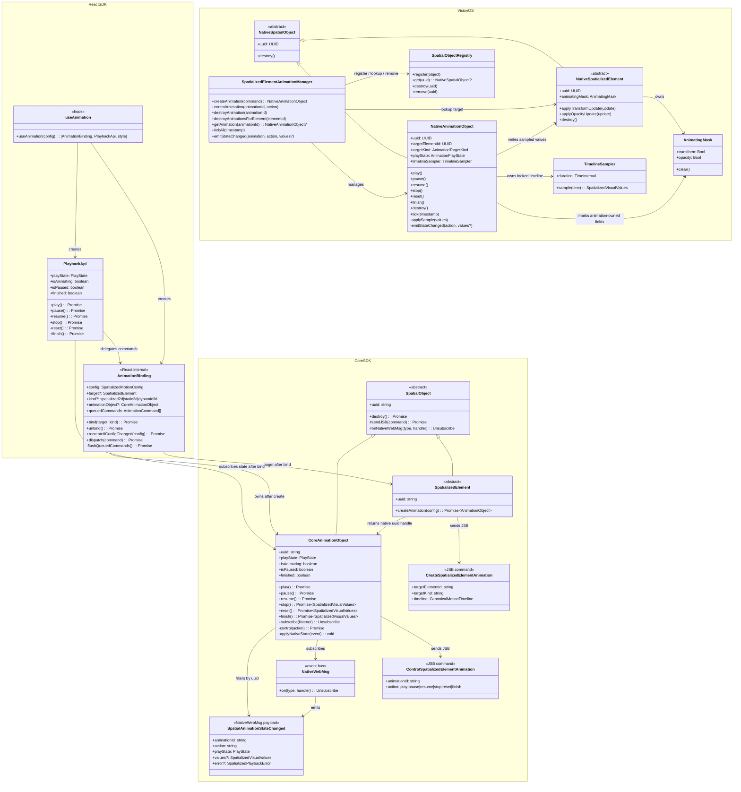
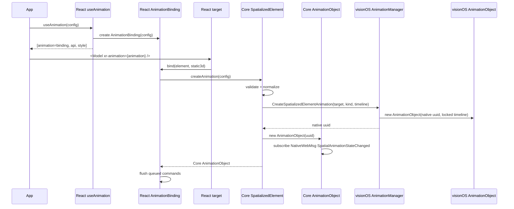
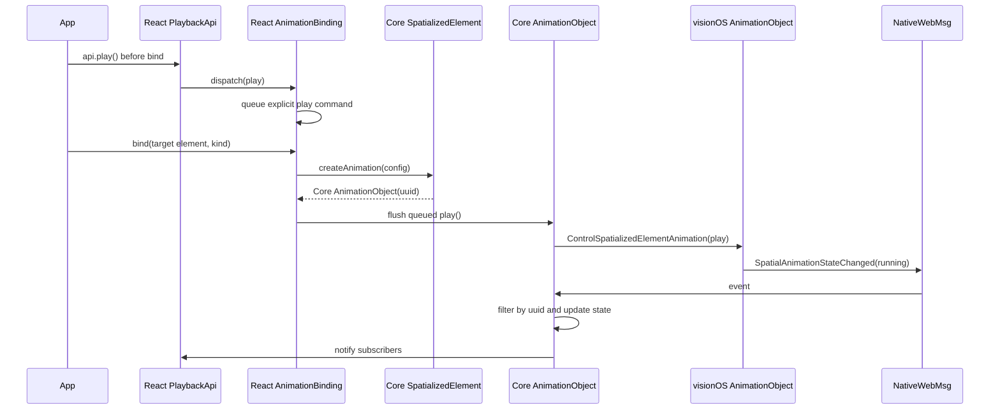
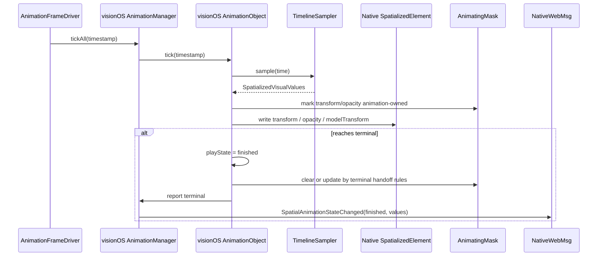
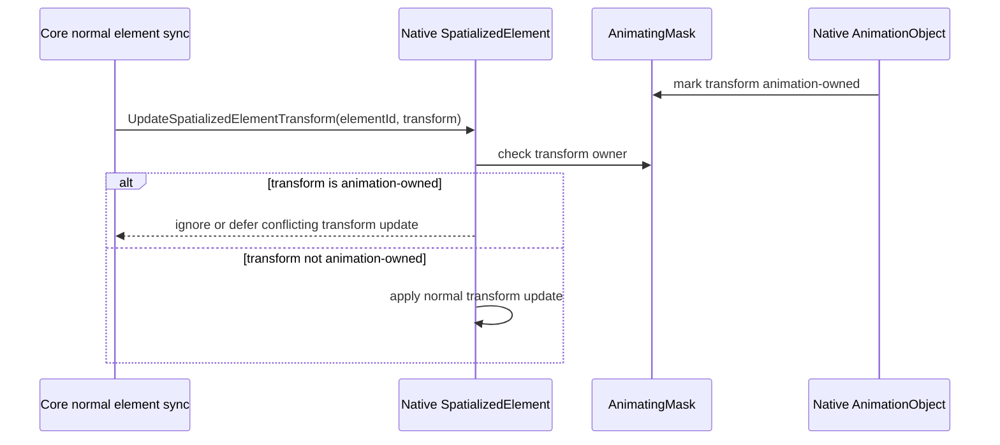
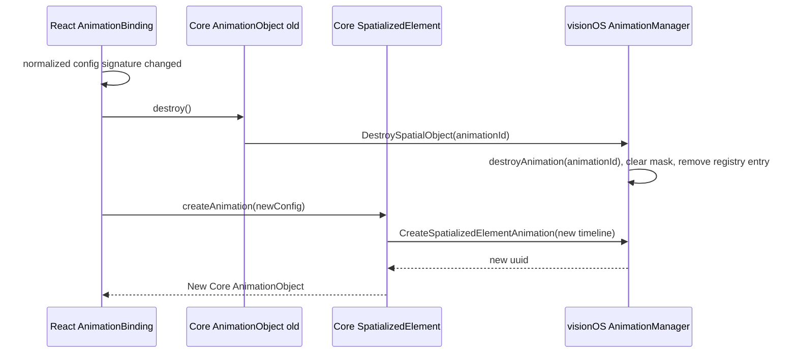

# AnimationObject architecture reference

This document is a non-normative architecture reference for the `spatialized-element-motion-api` target state. Normative MUST requirements remain in `specs/*/spec.md` and `specs/*/spec.zh.md`.

## Package responsibilities

| Layer | Core object | Responsibility |
|-------|-------------|----------------|
| React SDK | `AnimationBinding` | Created by `useAnimation(config)`, stores config, waits for `xr-animation` to bind a concrete target, and queues pre-bind commands. |
| React SDK | `PlaybackApi` | Exposes `play/pause/resume/stop/reset/finish`, delegates to `AnimationBinding`, and subscribes to Core `AnimationObject` state after bind. |
| Core SDK | `SpatializedElement` | Concrete spatial element object that exposes `createAnimation(config)`. |
| Core SDK | `AnimationObject extends SpatialObject` | First-class Core animation object with native uuid, direct playback methods, inherited `destroy()`, and direct `NativeWebMsg` subscription. |
| visionOS | `AnimationObject extends SpatialObject` | First-class native animation object owning locked timeline sampler, playback state, frame timing, and target writes. |
| visionOS | `SpatializedElementAnimationManager` | Native animation manager for create/control lookup, registry, element destroy cascading, mask coordination, and WebMsg emission. |
| visionOS | `TimelineSampler` / `TimingFunction` / `TransformAdapter` | Reusable low-level sampling, easing, and target write adaptation from the current implementation. |

## Combined class diagram

## Creation sequence

## Pre-bind explicit play sequence

`autoStart: false` only disables implicit play-on-bind and MUST NOT drop explicit pre-bind `api.play()`.

## Frame sampling and writes

## Mask conflict sequence

The mask lives on native `SpatializedElement` runtime or target write adapter and does not depend on `PortalInstanceObject`.

## Config changes

Config changes do not hot-update an existing object. Target state uses destroy + recreate.

## Current visionOS implementation reuse strategy

| Current capability | Reuse decision |
|--------------------|----------------|
| `SpatializedElementMotionTimelineSampler.swift` | Reuse directly as the locked sampler owned by native `AnimationObject`. |
| `SpatializedElementMotionTiming.swift` | Reuse timing function / loop config directly. |
| `SpatializedElementMotionTransformTypes.swift` | Reuse transform components directly. |
| `SpatializedElementMotionTransformAdapter.swift` | Refactor into target write adapter; Static3D opacity must still be rejected before create. |
| `SpatializedElementMotionManager.swift` | Refactor into `SpatializedElementAnimationManager`, preserving shared frame driver, lookup, terminal values, and compose/decompose ideas. |
| `SpatializedElementMotionSession.swift` | Do not keep the class; migrate timing fields and state algorithm into native `AnimationObject`. |
| `AnimateSpatializedElementMotionCommand` | Remove; replace with `CreateSpatializedElementAnimation` and `ControlSpatializedElementAnimation`. |
| `${animationId}_completed/canceled/failed` WebMsg | Remove; replace with unified `SpatialAnimationStateChanged`. |
