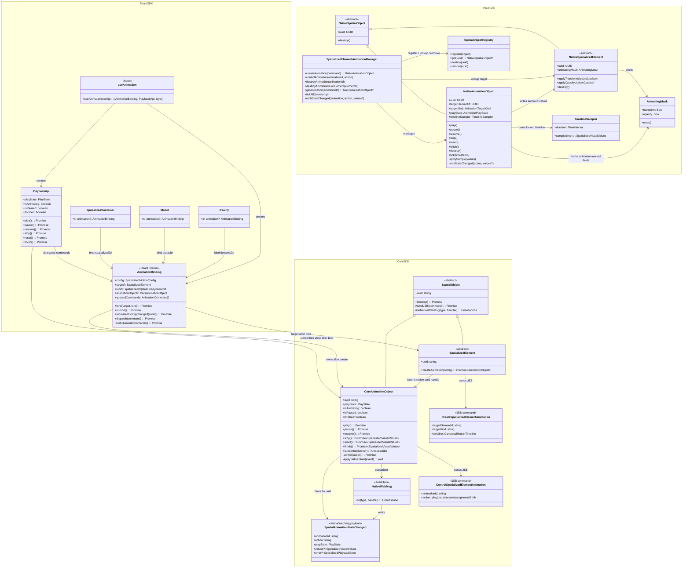
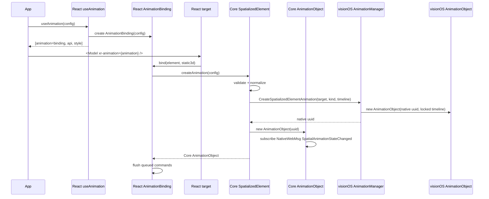
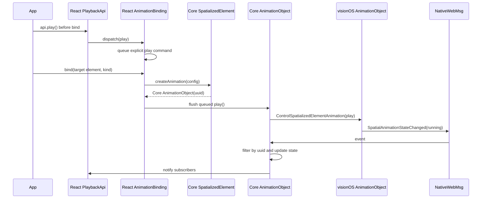
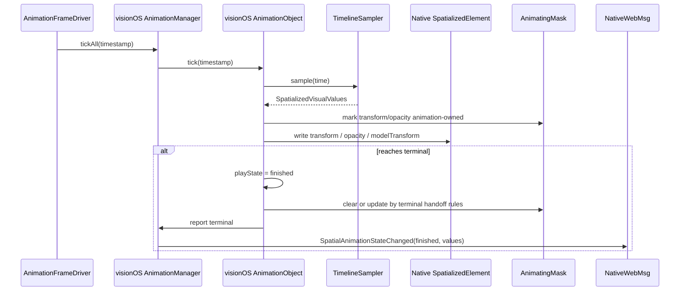
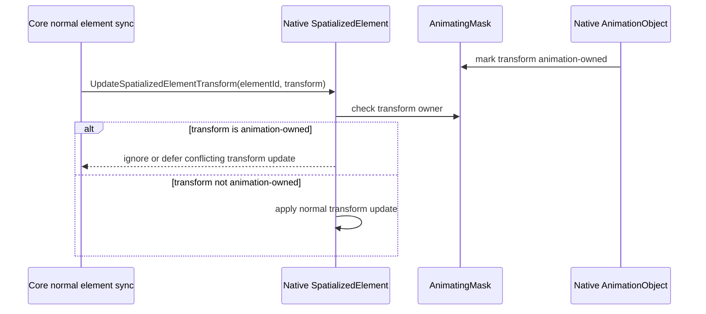
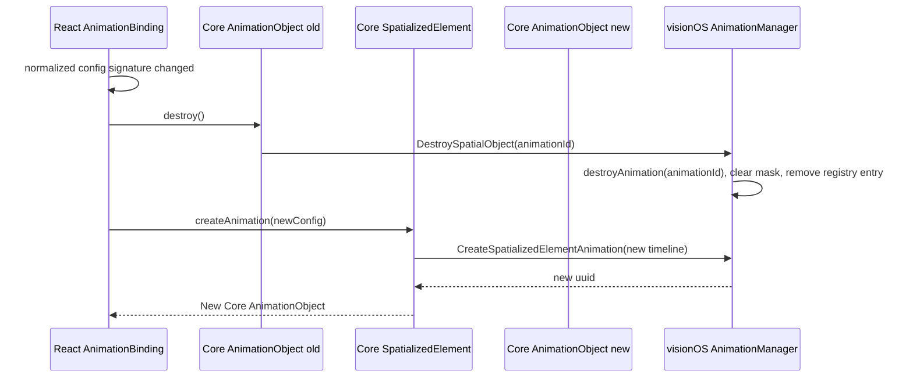

# AnimationObject 架构参考

本文是 `spatialized-element-motion-api` 目标态的非规范性架构参考。规范性 MUST 约束仍以 `specs/*/spec.md` 和 `specs/*/spec.zh.md` 为准。

## 三包职责

| 层 | 核心对象 | 职责 |
|----|----------|------|
| React SDK | `AnimationBinding` | 由 `useAnimation(config)` 创建，保存 config，等待 `xr-animation` 绑定具体 target，支持 bind 前命令排队。 |
| React SDK | `PlaybackApi` | 暴露 `play/pause/resume/stop/reset/finish`，内部转发给 `AnimationBinding`，绑定后订阅 Core `AnimationObject` 状态。 |
| Core SDK | `SpatializedElement` | 具体空间元素对象，提供 `createAnimation(config)`。 |
| Core SDK | `AnimationObject extends SpatialObject` | Core 一等动画对象，持有 native uuid，直接实现播放方法，继承 `destroy()`，直接订阅 `NativeWebMsg`。 |
| visionOS | `AnimationObject extends SpatialObject` | Native 一等动画对象，持有 locked timeline sampler、播放状态、frame timing 和 target 写入逻辑。 |
| visionOS | `SpatializedElementAnimationManager` | Native 动画管理器，负责 create/control lookup、registry、element 级联销毁、mask 协调和 WebMsg 广播。 |
| visionOS | `TimelineSampler` / `TimingFunction` / `TransformAdapter` | 现有实现中可复用的底层采样、缓动和写入适配能力。 |

## 合并类图

## 创建时序

## Bind 前显式 play 时序

`autoStart: false` 只禁止 implicit play-on-bind，不得丢弃 bind 前显式 `api.play()`。

## 每帧采样与写入

## Mask 冲突时序

Mask 位于 native `SpatializedElement` runtime 或 target write adapter，不依赖 `PortalInstanceObject`。

## Config 变化

Config 变化不做 hot update；目标态使用 destroy + recreate。

## 现有 visionOS 实现复用策略

| 现有能力 | 复用结论 |
|----------|----------|
| `SpatializedElementMotionTimelineSampler.swift` | 直接复用为 native `AnimationObject` 的 locked sampler。 |
| `SpatializedElementMotionTiming.swift` | 直接复用 timing function / loop config。 |
| `SpatializedElementMotionTransformTypes.swift` | 直接复用 transform components。 |
| `SpatializedElementMotionTransformAdapter.swift` | 改造为 target write adapter；Static3D opacity 仍必须在 create 前 reject。 |
| `SpatializedElementMotionManager.swift` | 重构为 `SpatializedElementAnimationManager`，保留 shared frame driver、查找、terminal values、compose/decompose 思路。 |
| `SpatializedElementMotionSession.swift` | 不保留类；迁移 timing 字段和状态算法到 native `AnimationObject`。 |
| `AnimateSpatializedElementMotionCommand` | 废弃；替换为 `CreateSpatializedElementAnimation` 和 `ControlSpatializedElementAnimation`。 |
| `${animationId}_completed/canceled/failed` WebMsg | 废弃；替换为统一 `SpatialAnimationStateChanged`。 |
