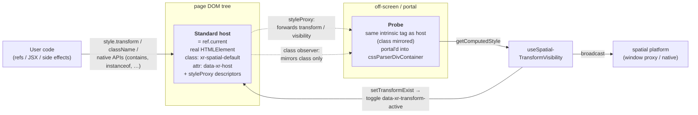
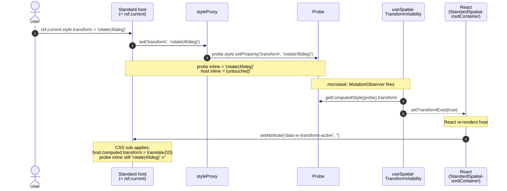

# Spatialized Container Architecture

> Internal architecture notes for `@webspatial/react-sdk`'s spatialized container layer (`SpatialDiv`, `Model`, `Reality` entities, `Spatialized2DElementContainer`). Audience: SDK maintainers. Users of the SDK should never need to read this — see the package README and [openspec specs](../../../../openspec/specs/) instead.

## TL;DR — 30-second mental model

If you forget everything else, remember these five points:

1. **Two DOMs, one ref.** Each spatial container renders a *standard host* (in the page tree, what `ref.current` points to) and a *probe* (off-screen, portaled to a hidden CSS-parser div). The probe is the platform's source of truth for `transform` / `visibility`.
2. **`ref.current` is a real `HTMLElement`.** No Proxy wrapper. Native APIs (`instanceof Node`, `parent.contains(...)`, `ResizeObserver.observe(...)`, …) all just work.
3. **`ref.current.style.transform` / `style.visibility` writes are silently re-routed to the probe** by descriptors installed via `Object.defineProperty`. Reads return the probe's value too.
4. **The host is hidden via CSS rules, not inline style.** Inline `transform`/`visibility` writes from anyone (including React's own commits) would leak through the styleProxy and clobber the probe. The CSS rule is keyed on `.xr-spatial-default[data-xr-host]` so unrelated DOM is unaffected.
5. **Two markers are non-negotiable on the host:** the class token `xr-spatial-default` and the data attribute `data-xr-host`. Three layers — JSX render, `className` descriptor, MutationObserver self-heal — keep them present even if user code or third-party libraries strip them.

## Two-DOM split: standard host + probe



**Why split?** The standard host is what the user can see/measure in the page (layout, sibling order, scroll context, etc.), and the probe is the source of truth for what the spatial layer renders. Decoupling them lets the host stay invisible (so the page doesn't show duplicate 2D placeholders) while the probe carries the user's spatial transform/visibility through the CSS engine to the platform side.

| | Standard host | Probe |
| --- | --- | --- |
| Where | In the page tree, owned by `StandardSpatializedContainer` | Portal'd into a hidden `cssParserDivContainer` in `<body>` |
| Visible? | Always hidden via CSS (`.xr-spatial-default[data-xr-host]` rule) | Off-screen (`left/top: -10000`, `opacity: 0`) |
| `ref.current` | **Yes** — exposed to user code | No |
| `style.transform` / `visibility` | Written via `setAttribute` (data-attr toggle), never inline | Holds the **user's** spatial values inline |
| Class | `xr-spatial-default` + user classes; mirrored to probe | Mirrored from host (class only, not data-\*) |
| Element tag | User's intrinsic (`h1`, `div`, `section`, …) | Same intrinsic when `component` is a string; **`div` fallback** for custom React component types (`resolveProbeIntrinsicTag`) |

`TransformVisibilityTaskContainer` receives `component` from `SpatializedContainer` so tag selectors in stylesheets (e.g. `h1 { transform: … }`) can reach the probe via `getComputedStyle`. Only **`class`** is mirrored from host → probe; `data-xr-*` stays host-only (I4).

## What `ref.current` is

`ref.current` is **the real standard-host `HTMLElement`** (`instanceof Node === true`, `parent.contains(ref.current) === true`, `getComputedStyle(ref.current)` works, `ResizeObserver.observe(ref.current)` works, etc.).

`SpatialContainerRefProxy.installSpatialRefBehavior` (in [`hooks/useDomProxy.ts`](./hooks/useDomProxy.ts)) installs a few spec-correct property descriptors on top of that element:

| Property | Behavior on the host |
| --- | --- |
| `style` (getter) | Returns a `Proxy<CSSStyleDeclaration>` over the raw style. |
| `style.transform` / `style.visibility` (set/get) | **Forwarded to the probe.** Reads return the probe's value; writes are applied to the probe. |
| `style.setProperty` / `removeProperty` / `getPropertyValue` | Same forwarding for `'transform'` / `'visibility'`; preserves the `priority` argument; falls through to native for everything else. |
| `style.cssText` (set) | Spatial properties (`transform`, `visibility`) extracted and applied to the probe; remainder applied to the host raw style alongside `transform: none; visibility: hidden;`. |
| `style[SpatialCustomStyleVars.*]` (set) | Applied directly to the host's raw style (CSS custom properties). |
| `className` (set) | Always preserves the `xr-spatial-default` class **token** (see invariants). |
| `removeAttribute('style')` | Resets the host inline style to `'visibility: hidden; transition: none; transform: none;'` and clears `transform`/`visibility` on the probe. |
| `removeAttribute('class')` | Resets className to `'xr-spatial-default'`. |
| `removeAttribute(otherName)` | Falls through to native `removeAttribute`. |
| `xrClientDepth` / `xrOffsetBack` (getter) | Reads `--xr-depth` / `--xr-back` from the host's raw style. Installed only when `supports(...)` is true at mount time. |
| `extraRefProps` keys | Installed as own properties with get/set delegating to the user-supplied factory. |

These descriptors are removed (`Object.defineProperty` with `configurable: true`) when the standard host is swapped or the component unmounts (`clearInstalledProperties`).

## Critical data flows

The hard part of this architecture isn't the static structure — it's the **time ordering** between user code, the styleProxy, the probe, the `useSpatialTransformVisibility` watcher, and React's own re-renders. Two flows are worth visualizing because the bugs they prevent are non-obvious from reading the code in isolation.

### Flow 1 — user sets a spatial transform



**What the fix is preventing.** In the broken pre-fix design, step 7 above was `host.style.transform = 'translateZ(0)'` (inline) instead of `setAttribute('data-xr-transform-active', '')`. That inline write would have hit the styleProxy and re-routed `'translateZ(0)'` to the probe, clobbering the user's `'rotate(45deg)'` and making the platform see an identity transform. The fix uses a `data-*` attribute (which goes through `setAttribute`, bypassing the proxy) plus a class-scoped CSS rule, so the host's stacking context is upgraded **without** any inline write reaching the proxy. See [PR #1194](https://github.com/webspatial/webspatial-sdk/pull/1194), Codex review P1.

### Flow 2 — class invariant self-heal

```mermaid
sequenceDiagram
    autonumber
    actor C as External code<br/>(user / 3rd-party)
    participant H as Standard host
    participant O as Class<br/>MutationObserver

    C->>H: classList.remove('xr-spatial-default')<br/>or setAttribute('class', 'foo')<br/>or el.className = '…'
    Note over H: class attr now lacks the<br/>xr-spatial-default token

    Note over H,O: microtask: MutationObserver fires
    O->>H: classList.contains('xr-spatial-default') ?
    alt token missing
        O->>H: classList.add('xr-spatial-default')
        Note over H: invariant restored<br/>(no paint between strip and restore)
    else token present
        Note over O: no-op; sync class to probe
    end
```

The window between the strip and the restore is bounded by one microtask, and browsers paint at frame boundaries — so no frame is ever painted with the bare placeholder. This same observer also runs the existing host → probe class mirror; both responsibilities share one MutationObserver registration.

## Invariants on the standard host

These are the contracts the rest of the architecture **depends on**. Future code in this directory MUST preserve them.

### I1. The host always carries `xr-spatial-default` as a class token

- **Why:** The hidden-placeholder CSS rule is keyed on `.xr-spatial-default[data-xr-host]`. Losing the token un-hides the 2D placeholder and drops the spatial CSS variables (`--xr-back`, `--xr-depth`, `--xr-z-index`, `--xr-background-material`).
- **Enforced at three layers:**
  1. **JSX render** in [`StandardSpatializedContainer.tsx`](./StandardSpatializedContainer.tsx) always merges `xr-spatial-default` into the className prop.
  2. **`className` descriptor** in [`hooks/useDomProxy.ts`](./hooks/useDomProxy.ts) re-appends the token via `classList.add` after applying the user's value.
  3. **MutationObserver self-heal** (`SpatialContainerRefProxy.ensureSpatialDefaultClass`) re-appends if any native path (`setAttribute('class', …)`, `classList.remove(...)`, `classList.replace(...)`, third-party DOM helpers) strips it — see [Flow 2](#flow-2--class-invariant-self-heal). Asynchronous (one microtask) but bounded; no paint occurs in between. The observer is **attached before the ref is published to user code** so synchronous native-API mutations performed inside a user callback ref are still caught.
- **Token vs substring:** the check **MUST** use `classList.contains` / `classList.add`, never `indexOf`, otherwise values like `foo-xr-spatial-default-theme` would falsely satisfy the invariant. The CSS selector keys on the token, not the substring.

### I2. The host always carries `data-xr-host=""`

- **Why:** Same hidden-placeholder rule depends on this attribute. CSS rules in [`injectSpatialDefaultStyle`](./StandardSpatializedContainer.tsx) are scoped to `.xr-spatial-default[data-xr-host]` — class+attribute pair — so unrelated DOM in the host application that happens to use either marker alone is unaffected.
- **Enforced by JSX prop ordering:** the SDK-controlled attribute is placed **after** `{...restProps}` so user-supplied `data-xr-host={undefined}` / `=…` cannot override it. See `StandardSpatializedContainerBase`.

### I3. `data-xr-transform-active` reflects the spatial transform watcher exclusively

- The attribute is added to the host iff `useSpatialTransformVisibilityWatcher` reports a non-`'none'` transform. The CSS rule `.xr-spatial-default[data-xr-host][data-xr-transform-active] { transform: translateZ(0) !important; }` then promotes the host into its own stacking context.
- **Why it must not be user-overridable:** a user-forced value would diverge the host's stacking-context state from the spatial transform watcher, leading to incorrect compositing.
- Enforced by the same JSX prop ordering as I2.

### I4. The probe never carries `data-xr-host` / `data-xr-transform-active`

- The class observer mirrors `class` only (`attributeFilter: ['class']`), so SDK-controlled `data-*` attributes do not bleed onto the probe.
- This is what lets the hidden-host CSS rules apply only to the host while the probe is left to render its own (user-driven) spatial style.

### I5. Host CSS appearance is driven by class rules, NOT inline style

- `StandardSpatializedContainer` MUST NOT write `transform`, `visibility`, or `transition` as inline style on the host. Doing so triggers the host's spatialized style proxy and forwards the React-internal value to the probe, clobbering the user's spatial transform — see [Flow 1](#flow-1--user-sets-a-spatial-transform).
- Mechanism: `data-xr-host` / `data-xr-transform-active` data attributes (set via `setAttribute`, which bypasses the style proxy) gate CSS rules with `!important` to preserve the legacy "user inline style cannot un-hide the host" contract.

### I6. styleProxy on the host MUST be a `CSSStyleDeclaration` proxy, not a wrapper around a different node

- The proxy is over `dom.style` itself; reads of non-spatial properties pass through with `Reflect.get`. This guarantees that `getComputedStyle`, layout, and CSS variable resolution remain identical to a vanilla `HTMLElement`.

### I7. The hidden-host stylesheet must be reachable from each host's tree root

- **Why:** I1–I5 all rely on the CSS rules in `injectSpatialDefaultStyle` (the spatial CSS variable defaults and the class-scoped hiding rules). Document-level stylesheets do not cross shadow boundaries, so a host mounted inside a `ShadowRoot` would otherwise miss them and show the bare 2D placeholder.
- **Enforced by:** `SpatialContainerRefProxy.updateStandardSpatializedContainerDom` calls `ensureSpatialDefaultStyleInRoot(dom.getRootNode())` whenever a non-null host is attached. The helper is **idempotent per root** via the `data-xr-spatial-default-style` marker attribute on the inserted `<style>` element, so per-mount calls never accumulate duplicates.
- **Why per-mount, not just `initPolyfill`:** the document is covered by `initPolyfill` at module load, but shadow roots are created at runtime by host applications (web components, micro-frontends, design-system shadow wrappers). The polyfill cannot eagerly enumerate every shadow root that will ever exist; piggy-backing on host attach is the cheapest way to react to them.

## Anti-patterns (do **not** do these)

These are the patterns Codex review on [PR #1194](https://github.com/webspatial/webspatial-sdk/pull/1194) explicitly caught. Each maps to one or more of the invariants above.

| ❌ Anti-pattern | What it breaks | Caught in |
| --- | --- | --- |
| Write `host.style.transform = 'translateZ(0)'` (or `visibility`/`transition`) inline from React | I5 — forwards to probe, clobbers user's transform | PR #1194 P1 |
| Use unscoped CSS like `[data-xr-host] { … !important }` | I2 — would hide unrelated DOM in the host application | PR #1194 P2 |
| Place SDK-controlled attributes **before** `{...restProps}` | I2/I3 — user can override and un-hide the host | PR #1194 P2 |
| Use `indexOf('xr-spatial-default')` to test class presence | I1 — false positive on `foo-xr-spatial-default-theme` | PR #1194 P2 |
| Trust `el.className =` to be the only class write path | I1 — `setAttribute('class', …)` / `classList.remove(...)` / `classList.replace(...)` bypass it | PR #1194 P2 |
| Drop `xr-spatial-default` when `className = ''` | I1 — un-hides the host | PR #1194 P2 |
| Trust the document-level stylesheet to apply inside shadow roots | I7 — shadow boundaries do not let document CSS through; the host shows the bare 2D placeholder | PR #1194 P2 |
| Publish the ref before attaching the class observer | I1 — synchronous user-side class mutations from a callback ref escape the self-heal | PR #1194 P2 |

## Portal lifecycle and local dev (HMR)

> **Audience:** maintainers editing `PortalSpatializedContainer`, `Spatialized2DElementContainer`, or hooks under `hooks/`. End users do not need this section.
>
> **Background:** [#1238](https://github.com/webspatial/webspatial-sdk/issues/1238), PR [#1239](https://github.com/webspatial/webspatial-sdk/pull/1239).

SpatialDiv / Model / Reality entities that open a **portal** (native sub-webview) follow a different path than the standard host + probe model above. The portal stack is wired in `PortalSpatializedContainer` → `SpatializedContent` (`createPortal` into the spatial `windowProxy`).

### Responsibility split

| Piece | Role |
| --- | --- |
| `useSpatializedElement` | Async `createSpatializedElement()`, `attachSpatializedElement`, exposes `spatializedElement` state |
| `useSync2DFrame` | Subscribes to `on2DFrameChange`, calls `portalInstanceObject.notify2DFrameChange()` so `cachedDomInfo` / `dom` / `computedStyle` stay aligned with the standard-instance DOM |
| `useSpatialContentReady` | `onSpatialContentReady` when `spatializedElement`, `portalInstanceObject.dom`, and a connected `hostElement` are all present |
| `PortalInstanceContext` | Default value is `null`; consumers must not assume a provider is always reachable during hot reload |

`PortalSpatializedContainer` only renders `<Content />` when `spatializedElement` is truthy. Clearing that state unmounts the entire portal React subtree (including `createPortal` children), which is the main cause of a **blank portal webview** after a bad effect cleanup.

### Invariants (do not break)

1. **Defer native element teardown on effect re-run.** When `createSpatializedElement` changes (Vite HMR, deps change), the first effect cleanup must **not** `destroy()` the live element or `setSpatializedElement(undefined)`. Cancel in-flight work only; destroy the previous element when the replacement resolves, or on portal unmount (second effect keyed on `portalInstanceObject`).
2. **Re-sync the 2D frame after the element is available.** `useSync2DFrame` must call `notify2DFrameChange()` on mount and when `spatializedElement` becomes available or is replaced (`useLayoutEffect` on `spatializedElement`). Without this, `portalInstanceObject.dom` stays stale and portal content loses layout/styles.
3. **Never read `portalInstanceObject.dom` bare in hook dependency arrays.** React evaluates deps before the effect body. Use optional chaining (`portalInstanceObject?.dom`) and allow `portalInstanceObject | null`. Prefer passing `portalInstanceObject` from `PortalSpatializedContainer` as a prop instead of `useContext` inside `SpatializedContent` so linked-SDK HMR is less sensitive to duplicate `PortalInstanceContext` module instances.
4. **Do not promote lazy 3D loading while `dom` is missing.** `SpatializedStatic3DElementContainer` must wait for frame sync when `portalInstanceObject.dom` is undefined; do not call `setEffectiveLoading('eager')` as a shortcut (regression for [#1192](https://github.com/webspatial/webspatial-sdk/issues/1192)).

### Portal head sync (CSS-in-JS) ([#1265](https://github.com/webspatial/webspatial-sdk/issues/1265))

> **Audience:** maintainers editing `windowStyleSync.ts`, `useSyncHeadStyles.ts`, `useSync2DFrame.ts`, or `Spatialized2DElementContainer`.
>
> **Background:** SpatialDiv / Attachment portal content is rendered via `createPortal(..., windowProxy.document.body)`, but React and CSS-in-JS runtimes still execute in the **host** page. Runtime libraries such as styled-components and Emotion inject rules into the host `document.head` (often via `CSSStyleSheet.insertRule` / `deleteRule`). Each portal is a separate child webview and needs its own mirrored copy of those rules.

#### Model

| Layer | Document | Role |
| --- | --- | --- |
| Host page | `document` | React tree, styled-components / Emotion injection target |
| Portal webview | `windowProxy.document` | Visible UI via `createPortal`; `<head>` is mirrored from the host |

Sync is **host → portal**, never portal → portal. Nested SpatialDivs and many flat SpatialDivs each get their own `windowProxy`, but all read from the same host `document.head` source.

#### Key pieces

| Piece | Role |
| --- | --- |
| `useSyncHeadStyles` | Thin hook: `registerParentHeadSyncTarget(childWindow)` on mount, `disposeSyncParentHeadToChild` on unmount (`Spatialized2DElementContainer`, `AttachmentEntity`) |
| `registerParentHeadSyncTarget` | Adds the portal to the global registry and schedules an initial head sync |
| `windowStyleSync.ts` registry | One `MutationObserver` on host `document.head`, one `domUpdated` listener, one CSSOM `insertRule` / `deleteRule` patch while any target is active |
| `captureParentHeadSnapshot` | Reads host `<style>` / `<link rel=stylesheet>` once per sync wave; serializes `sheet.cssRules` when available |
| `syncStyleSheetRulesToChild` | Reuses portal `<style data-webspatial-sync>` nodes in place; incremental `insertRule` / `deleteRule` when possible |
| `useSync2DFrame` | Before portal `forceUpdate`, runs `scheduleSyncParentHeadToChild(childWindow, 'afterHostLayout', onComplete)` so CSS-in-JS can commit head rules after host layout |

#### Sync waves

The registry coalesces work into **waves** to avoid O(N) parent-head reads when N portals are active:

- **Broadcast** (all active portals): host `MutationObserver`, CSSOM patch, `domUpdated` event.
- **Single-target** (one portal): `scheduleSyncParentHeadToChild` from `useSync2DFrame` (`afterHostLayout`) or direct callers.

Timing priority within a wave: `immediate` > `afterHostLayout` > `delayed`. `immediate` cancels a pending `delayTimer`. Portal head **writes** remain O(N) — each webview must be updated separately.

#### Invariants (do not break)

1. **Serialize from `cssRules`, not `cloneNode` alone.** CSS-in-JS often updates CSSOM without mutating `<style>` text children.
2. **Patch only parent head sheets.** `isParentHeadStyleSheet` must gate the CSSOM prototype patch so child-portal `insertRule` during sync does not recurse.
3. **Restore the CSSOM patch when the last target unregisters.** Do not leave `CSSStyleSheet.prototype` patched globally.
4. **Sync before 2D-frame portal refresh.** `useSync2DFrame` must keep the `afterHostLayout` → sync → `forceUpdate` ordering for prop-driven styled updates.
5. **Mixed mutation batches prefer `immediate`.** A `<link rel=stylesheet>` record in the same batch must not downgrade co-occurring `<style>` text / `characterData` updates to `delayed`.
6. **`<link>` sync stays idempotent.** Keep `data-webspatial-sync-key`, per-window `version`, and `isCurrent()` guards for async stylesheet loads ([#1033](https://github.com/webspatial/webspatial-sdk/issues/1033)).
7. **Dispose stops further sync for that window.** `disposeSyncParentHeadToChild` must filter disposed targets out of pending waves.

#### Manual validation (test-server)

| Route | What it exercises |
| --- | --- |
| `#/styledComponentsSpatialTest` | styled-components on host, child, nested SpatialDiv; inspector helpers `__probeStyledComponentsSpatialHeadSync`, `__runStyledComponentsSpatialOpacitySweep` |
| `#/head-style-sync` | `<link rel=stylesheet>` dedupe / stress (not CSSOM flicker) |

#### Known limitations

- **Custom injection targets** (e.g. styled-components `StyleSheetManager` targeting a portal or shadow `document.head`) are not mirrored — sync reads host `document.head` only.
- **Synced `<style>` nodes are paired by index** with parent `<style>` nodes. Append/update flows (typical CSS-in-JS) are stable; devtools/HMR that reorder parent `<style>` nodes may need future stable keying.
- **`domUpdated` triggers a broadcast `afterHostLayout` wave** for all active portals (correctness-first).

End-user summary: [`docs/webspatial-quirks.md`](../../../../docs/webspatial-quirks.md) — *CSS-in-JS in SpatialDiv*.

### Local development notes

| Setup | What it exercises |
| --- | --- |
| Monorepo `npm run dev` (`apps/test-server`) | esbuild alias to `packages/react/src` + LiveReload (full page). Good for manual XR pages; **not** the same as Vite Fast Refresh. |
| External app + **linked** `@webspatial/react-sdk` + **Vite** | The #1238 scenario. Ensure a single React and a single context module (`resolve.dedupe: ['react', 'react-dom']`, alias SDK to one copy). |

### Test map (portal / HMR)

| Behavior | Test |
| --- | --- |
| HMR-style effect re-run keeps element until replacement | `hooks/useSpatializedElement.hmr.test.ts` |
| `portalInstanceObject` null-safe deps / props | `hooks/useSpatialContentReady.test.ts` |
| Lazy 3D when `dom` appears after sync | `SpatializedStatic3DElementContainer.test.tsx` |
| `useSync2DFrame` mount + element-driven sync | `coverage-boost.test.ts` (filtered cases for `useSync2DFrame`) |
| `useSync2DFrame` `afterHostLayout` head sync before re-render | `hooks/useSync2DFrame.test.tsx` |
| Portal head sync / CSSOM / registry waves | `utils/windowStyleSync.test.ts` |
| `useSyncHeadStyles` register + dispose | `utils/useSyncHeadStyles.test.tsx` |

Run focused checks:

```sh
cd packages/react && pnpm exec vitest run src/spatialized-container/
cd packages/react && pnpm exec vitest run src/utils/windowStyleSync.test.ts src/utils/useSyncHeadStyles.test.tsx
```

## Known limitations

### iframe / foreign-Document hosts ([#1197](https://github.com/webspatial/webspatial-sdk/issues/1197))

The per-mount stylesheet injection in `SpatialContainerRefProxy.updateStandardSpatializedContainerDom` currently uses `root === document` to detect Document roots, which only matches the **module's own global document**. A spatial host rendered (or portaled) into a same-origin `<iframe>`'s `contentDocument` — or any other foreign `Document` instance — would not get the stylesheet, and the bare 2D placeholder would show through.

This is a niche scenario (it requires React + WebSpatial inside an iframe, not just the iframe itself), and was deliberately deferred from PR #1194 to keep scope focused. The fix path is described in #1197 (switch the discriminator from `root === document` to `root.nodeType === 9`, plus a regression test against `iframe.contentDocument`).

**Workaround in the meantime:** call `injectSpatialDefaultStyle()` once from inside the iframe's own realm (e.g. an entry script that runs there). Cross-origin iframes are out of scope — the SDK cannot reach across origins anyway.

### Stylesheet selectors vs. the probe ([#1263](https://github.com/webspatial/webspatial-sdk/issues/1263))

The probe lives under `cssParserDivContainer` in `<body>`, **not** under the user's page subtree. Therefore:

- **Tag** and **class** selectors that do not depend on page ancestors usually work on the probe (tag matching requires the probe to use the same intrinsic element as the host — see table above).
- **Ancestor** selectors tied to the page tree (e.g. `.page h1`, `.layout > h1`) may **not** match the probe even when they match the host.
- **Inherited** properties can differ between host and probe because their ancestor chains differ.

**Workarounds:** prefer class selectors (`.mySpatialPanel`), inline `style` on the element, or `ref.current.style.transform = …` (forwarded to the probe via the style proxy). For custom React components wrapped with `enable-xr`, the probe stays `div` — use class or inline style, not tag selectors on the wrapper's display name.

End-user summary: [`docs/webspatial-quirks.md`](../../../../docs/webspatial-quirks.md) — *SpatialDiv / `enable-xr` and CSS*.

### Nested SpatialDiv parent bounds (test-server `#/nested-spatial-overflow`)

Nested child `SpatialDiv` instances are separate native webview layers composited as siblings in the parent's `ZStack` (`Spatialized2DElementView`), not as content inside the parent webview surface. Therefore:

- Parent `overflow` maps to `scrollPageEnabled`, not child clipping.
- Child size/position come from the child's DOM rect (offset from parent for non-`fixed` children).
- Parent `materialWithBorderCorner` `clipShape` applies to the parent webview only.

**Workaround:** constrain child CSS size, or use one `SpatialDiv` with plain HTML for overflow clipping inside the portal.

End-user summary: [`docs/webspatial-quirks.md`](../../../../docs/webspatial-quirks.md) — *Nested SpatialDiv / parent overflow*.

## Test coverage map

Each invariant has at least one regression test pinned in this directory:

| Invariant / behavior | Test |
| --- | --- |
| `ref.current instanceof Element` (no Proxy wrapper) | `useDomProxy.coverage.test.ts` — *"writes the native dom element as ref only when both doms exist"* |
| `ResizeObserver.observe(ref.current)` brand check | `useDomProxy.coverage.test.ts` — *"ref.current passes Element brand checks"* |
| Host data-attr writes do not perturb probe (I5) | `useDomProxy.coverage.test.ts` — *"host data-\* attribute writes do not clobber probe transform"* |
| Host has no inline `transform`/`visibility`/`transition` (I5) | `coverage-boost.test.ts` — *"applies default class + data attributes and toggles data-xr-transform-active"* |
| `data-xr-transform-active` toggles with watcher (I3) | same as above |
| SDK attributes are not overridable (I2/I3) | `coverage-boost.test.ts` — *"SDK data attributes are not overridable via spatial element props"* |
| Class invariant: `className = ''` keeps token (I1) | `useDomProxy.coverage.test.ts` — *"preserves xr-spatial-default when className is cleared"* |
| Class invariant: native paths self-heal (I1) | `useDomProxy.coverage.test.ts` — *"restores xr-spatial-default after native class mutations strip it"* |
| Class invariant: token, not substring (I1) | `useDomProxy.coverage.test.ts` — *"treats xr-spatial-default as a class token, not a substring"* |
| Class observer attached before ref publish (I1) | `useDomProxy.coverage.test.ts` — *"attaches class observer before publishing the ref so user-side native mutations self-heal"* |
| CSS rule is class-scoped, not global (I2) | `coverage-boost.test.ts` — *"injectSpatialDefaultStyle is idempotent and emits class-scoped data-xr-host rules"* |
| Stylesheet injected per host root incl. shadow roots (I7) | `useDomProxy.coverage.test.ts` — *"injects spatial default stylesheet into the host shadow root"* |
| Stylesheet injection is idempotent per root (I7) | `coverage-boost.test.ts` — same as above (asserts `length === 1` after three calls) |
| Probe mirrors host intrinsic tag; tag-selector CSS on probe | `TransformVisibilityTaskContainer.test.tsx` — *"portals an h1 probe"*, *"applies tag selectors from document stylesheets"* |
| Non-intrinsic `component` → `div` probe | `TransformVisibilityTaskContainer.test.tsx` — `resolveProbeIntrinsicTag` |

## Quick reference for new contributors

If you are changing **portal** hooks or `PortalSpatializedContainer`, read [Portal lifecycle and local dev (HMR)](#portal-lifecycle-and-local-dev-hmr) first and run `src/spatialized-container/` vitest.

If you are changing **portal head sync** (`windowStyleSync.ts`, `useSyncHeadStyles.ts`, `useSync2DFrame.ts`), read [Portal head sync (CSS-in-JS)](#portal-head-sync-css-in-js-1265) and run `src/utils/windowStyleSync.test.ts`.

If you are adding behavior to the standard host:

1. **Read this doc first.** Identify which invariants your change touches.
2. **Don't write `transform` / `visibility` / `transition` inline on the host.** Use a class or a `data-*` attribute that gates a CSS rule.
3. **Don't trust user-supplied props for SDK-controlled attributes.** Place them after `{...restProps}` in JSX.
4. **For class-token tests, use `classList.contains` / `classList.add`.** Never `indexOf`.
5. **For class-attribute mutations from any source, assume someone bypasses the descriptor.** Rely on the `MutationObserver` self-heal in `SpatialContainerRefProxy.attachStandardClassObserver`.
6. **For new SDK-controlled CSS rules**, scope them via `.xr-spatial-default[data-xr-host]` (or stricter) so unrelated DOM is unaffected. Add `!important` only when the contract truly requires "user CSS cannot override us".
7. **Bundle any new SDK-controlled CSS into `injectSpatialDefaultStyle` / `ensureSpatialDefaultStyleInRoot`** so it ships into the same per-root injection path. Don't add a parallel global `<style>`; that path skips shadow roots.
8. **Add at least one regression test per new invariant**, and update the table above.
